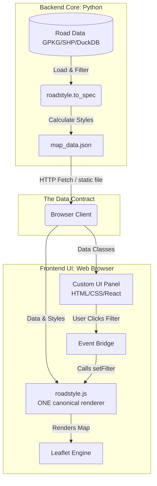

# Architecture Blueprint & Roadmap

This document is the engineering guide for making **`roadstyle`** maximally **flexible, reusable,
and embeddable** — while staying a focused, opinionated **road** cartography library.

The organizing idea is to separate **Mechanism** (the styling *compiler* + the map *drawer*) from
**Interface** (your website's custom UI), connected by one stable data contract: the `to_spec()`
JSON and its `__rs_*` per-feature style properties.

It is split into three parts:

1. **What already exists today** — so the roadmap reads as "finish + sharpen," not "build from scratch."
2. **The decoupled architecture** — the mechanism/interface split and the data contract.
3. **The roadmap** — the keystone, then four levers, in priority order.

---

## Part 0: What already exists today

A lot of the "decoupled architecture" below is **already built on the Python side**. Before
planning new work, here's the honest baseline (v0.2.0.dev0):

| Capability | Status | Where |
|---|---|---|
| Styling **compiler** (class + data-driven) | ✅ done | `stylers.py`, `style.py`, `palettes.py` |
| Canonical **JSON spec** (`spec/1`) with bounds, basemap, legend | ✅ done | `emit.py` → `to_spec()` |
| The **`__rs_*` property contract** (baked per-edge style) | ✅ done, stable | `emit.py` |
| A working **Leaflet renderer** of the spec | ✅ done | `emit.py` → `to_html()` (inline JS) |
| Five output formats (spec / GeoJSON / HTML / fragment / iframe) | ✅ done | `emit.py` |
| Registries for palettes / themes / basemaps | ✅ done | `palettes.py`, `themes.py`, `basemaps.py` |
| Palette JSON I/O (portable, language-neutral) | ✅ done | `palettes.py` → `save_palette`/`load_palette` |
| Canonical input normalization | ✅ done | `edges.py` → `as_edges`/`normalize_edges`/`load_edges` |
| Two backends (folium portable HTML, lonboard WebGL) | ✅ done | `render_folium.py`, `render_lonboard.py` |

**The actual gap.** The browser renderer is *real and working*, but it lives only as an **inline
string inside `emit.py`**, and a **second, separate** road-drawing implementation lives in
`interactive.py` (the folium interactive layer). The roadmap below does **not** ask you to build the
renderer from scratch — it asks you to **lift the one true renderer out into a single canonical file**
so it stops being duplicated and starts being reusable on its own.

> **Design rule for everything that follows: one renderer, one spec, one source of truth.**
> Three copies of the drawing logic guarantee drift; the keystone collapses them to one.

---

## Part 1: The Decoupled Architecture

Python's job: load road files, *compute* the visual styling, and emit a clean **JSON spec**. It does
**no drawing**. The browser's job: read the spec and *draw* it, with your own UI on top. The two
never need to know each other's internals — only the `__rs_*` contract between them.



### Module 1: The Backend Compiler (Python)

Python loads geographic road files, computes the visual styling (colors, casings, widths), and
writes a standardized **JSON spec**. No drawing, no HTML.

```python
# generate_spec.py
import geopandas as gpd
import roadstyle as rs

def export_map_data(input_path: str, output_path: str):
    """Load raw road edges, compute the visual styling spec, write a static JSON file."""
    edges = gpd.read_file(input_path)
    # Class styling, or data-driven: color_by="aadt", cmap="viridis", width_by=(2, 8)
    map_spec = rs.to_spec(edges, theme="dark", palette="highsat")
    rs.save_spec(map_spec, output_path)

if __name__ == "__main__":
    export_map_data("edges.gpkg", "map_data.json")
```

### The `__rs_*` Abstraction Contract

Python bakes its styling into every feature's `properties` under stable `__rs_`-prefixed keys.
**This is the public API between Python and any frontend** — version it carefully.

| Key | Meaning |
|---|---|
| `__rs_fill` | Main fill colour (hex) |
| `__rs_w` | Core line width (px) |
| `__rs_op` | Fill opacity |
| `__rs_dash` | Dash pattern (or null) |
| `__rs_casing` | Casing (outline) colour (hex) |
| `__rs_cw` | Casing width (px) |
| `__rs_cop` | Casing opacity |
| `__rs_class` | Category group for UI filters (e.g. `"motorway"`) |

Because the frontend reads only these uniform keys, **the JS never changes** whether you style by
road type or by speed/AADT — only the baked values differ.

### The Five Output Formats (`roadstyle.emit`)

| Output | Function | Type | Best for |
|---|---|---|---|
| **Full Spec** | `to_spec()` | JSON / `dict` | The gold standard for decoupled apps (geojson + bounds + basemap + legend). |
| **Pure GeoJSON** | `to_geojson()` | GeoJSON `dict` | Just geometry + baked `__rs_*` props, no basemap/legend metadata. |
| **Standalone Page** | `save()` | `.html` file | Zero-setup, double-click to view. |
| **Inline Fragment** | `to_html(full=False)` | `<div>`+`<script>` | Embed inside an existing page / notebook. |
| **Embedded iframe** | `to_iframe()` | `<iframe>` string | Drop into any CMS/portal as an isolated container. |

### Module 2: The Reusable Map Module (`roadstyle.js`)

A headless ES6 class that reads a spec and draws it on Leaflet: base map, the geometry sandwich
(casing under, fill over), hover, and selection. **No HTML/UI elements of its own** — your site
supplies the UI. Behaviour is configured via one `options` block (or an
`interaction_config.json`, below).

```javascript
// roadstyle.js  — ONE canonical renderer (emitted by to_html AND usable standalone)
export class RoadStyleMap {
    constructor(containerId, options = {}) {
        this.map = L.map(containerId);
        this.options = {
            hoverColor: options.hoverColor || "#FFFFFF",
            hoverExtraWidth: options.hoverExtraWidth || 2,
            hoverOpacity: options.hoverOpacity || 1.0,
            selectionStyle: options.selectionStyle || {
                glow:   { color: "#FF00FF", width: 12, opacity: 0.4 },
                casing: { color: "#000000", width: 7,  opacity: 1.0 },
                core:   { color: "#FFFFFF", width: 4,  opacity: 1.0 }
            },
            doubleClickZoom: options.doubleClickZoom !== false,
            zoomControl: options.zoomControl !== false
        };
        this.activeFilters = [];
        this.spec = null;
    }

    async load(specOrUrl, configOrUrl = null) {
        this.spec = typeof specOrUrl === "string" ? await (await fetch(specOrUrl)).json() : specOrUrl;
        if (configOrUrl) await this.loadInteractionConfig(configOrUrl);
        this._renderBaseMap();
        this._renderRoads();
    }

    setFilter(allowedClasses) { /* re-style by __rs_class membership */ }
    highlightRoad(feature)    { /* 3-layer neon-violet glow */ }
    getRoadClasses()          { /* unique __rs_class values, for building UI */ }
    // _renderBaseMap / _renderRoads: casing layer under, fill layer over, hover + click
}
```

### The Interaction Configuration Contract (`interaction_config.json`)

Keep visual interaction values out of the JS so a designer can tweak them without touching code.
This is the **JS-side** config — distinct from the Python-side *style recipe* (`save_config`,
Lever 3).

```json
{
  "hoverColor": "#38bdf8",
  "hoverExtraWidth": 3,
  "hoverOpacity": 1.0,
  "selectionStyle": {
    "glow":   { "color": "#38bdf8", "width": 14, "opacity": 0.5 },
    "casing": { "color": "#0f172a", "width": 8,  "opacity": 1.0 },
    "core":   { "color": "#ffffff", "width": 4,  "opacity": 1.0 }
  },
  "doubleClickZoom": true,
  "zoomControl": true
}
```

### Client Integration (custom UI ↔ map)

Your page imports the module, builds its own sidebar/checkboxes, and binds them to the map. Because
the user told us they don't write front-end, `roadstyle.js` also ships **optional prebuilt widgets**
(filter checkboxes, legend, basemap switcher) you can enable without writing any UI — see Lever 1.

```html
<script type="module">
  import { RoadStyleMap } from "./roadstyle.js";
  const roadMap = new RoadStyleMap("map");
  await roadMap.load("map_data.json", "interaction_config.json");

  // Build filter checkboxes from the data, or just enable the built-in widget:
  roadMap.getRoadClasses().forEach(cls => { /* render a checkbox */ });
</script>
```

---

## Part 2: The Roadmap (priority order)

**Locked direction:** road-focused · web/embedding audience first · one canonical JS renderer ·
headless core + optional widgets · single-file drop-in (no npm build step yet).

### ⭐ Keystone — one canonical `roadstyle.js`

Everything else hangs off this. Extract the browser renderer into a **single file**
(`src/roadstyle/static/roadstyle.js`), shipped as package data, and make `to_html()` emit *that*
file instead of its own inline copy. Result: the three renderers (emit.py inline JS,
`interactive.py`, and the proposed module) collapse toward **one source of truth**, and every
generated map self-tests it.

- **Headless core:** `RoadStyleMap` — `load()`, `setFilter()`, `highlightRoad()`, `getRoadClasses()`,
  geometry-sandwich layers, hover/selection.
- **Optional widgets** (opt-in, no JS required by the user): filter checkboxes, legend, basemap
  switcher.
- **Single-file drop-in:** usable via `<script>` *or* `import`; no build step, no `node_modules`.
- **Constraint:** the folium path stays **byte-identical**; unifying `interactive.py` into
  `roadstyle.js` is a later, explicitly-flagged step.

### Lever 1 — Wider inputs (cheap, high ROI)

Widen the input boundary in `edges.py` (`as_edges`/`normalize_edges`/`load_edges`) so `render_edges`
and `to_spec` also accept a **DuckDB connection + query**, a **GeoJSON dict**, a **file path**, and an
**Arrow table** — all normalized to the existing `RoadEdges` (EPSG:4326, lines). Removes friction for
every project that consumes roadstyle (sweden-road-data, osm-traffic-enrichment, gps-h3-map).

### Lever 2 — Declarative style config

Add `save_config`/`load_config`: a Python-side **style recipe** (palette + theme + basemap + styler
rule + legend) captured in one JSON/YAML file, alongside the existing palette JSON. Lets a non-coder
define and share a whole map style as data. Complementary to the JS-side `interaction_config.json`.

### Lever 3 — Pluggable backends (reframed)

- **Python:** replace the `if/elif` backend switch in `render.py` with a small `register_backend`
  Protocol/registry — cheap and clean.
- **JS (the backends that matter for the web audience):** add MapLibre / deck.gl renderers that
  consume the *same* spec, for very large / vector-tile datasets. These carry the
  **zoom→width curve** (fixes fixed-pixel blobbing at low zoom) and **lonboard legends**. The
  zoom→width curve is a renderer refinement, so it rides here rather than being its own foundation.

### Deferred (revisit only with external demand)

- **npm split** (`@roadstyle/core`, `/leaflet`, `/maplibre`, `/deckgl`) and a JS build toolchain.
  The single-file drop-in covers a no-front-end-toolchain workflow today; the monorepo split is a
  "later, if external JS developers appear" decision, not a foundation.
- **Client-side stylers** (porting classification/quantile breaks to JS for live dashboard sliders) —
  attractive, but only once a fully client-side, no-Python deployment is a hard requirement.

---

*Drafted by Claude (Anthropic), in dialogue with Kaveh, 2026-05-30.*
