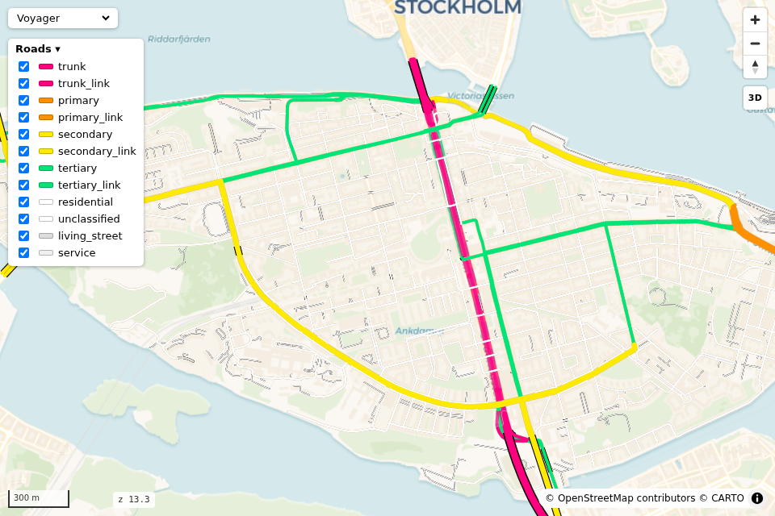
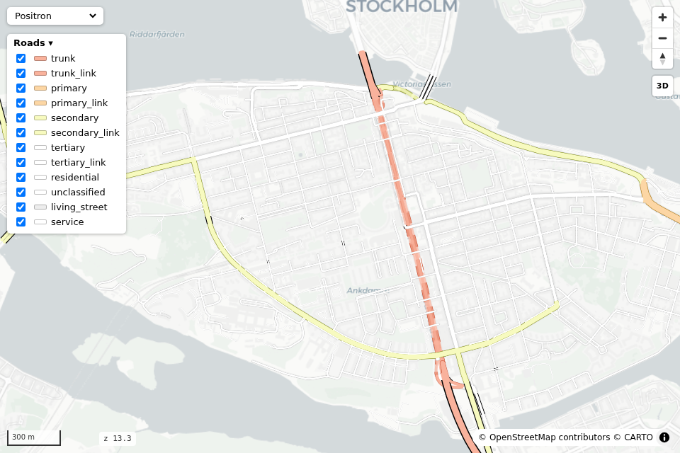
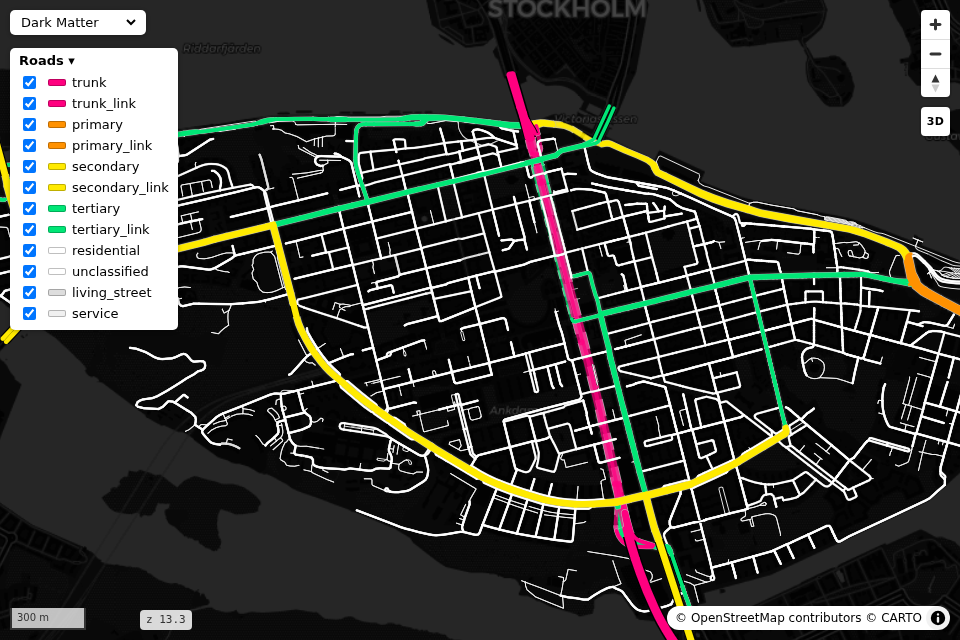
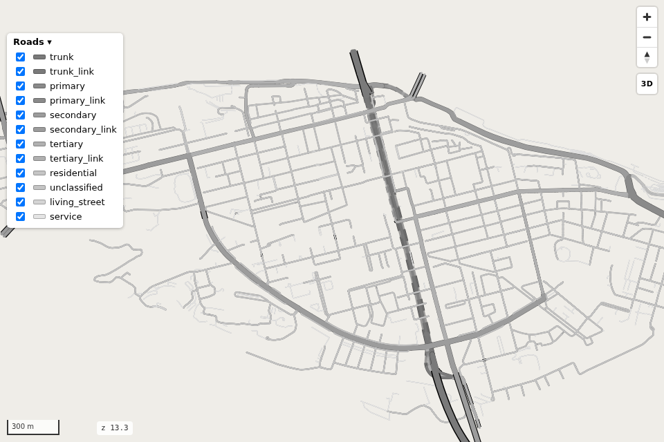
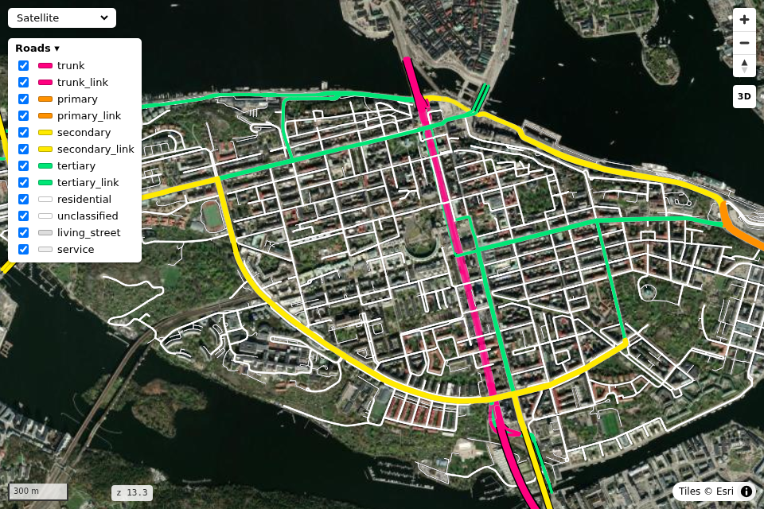
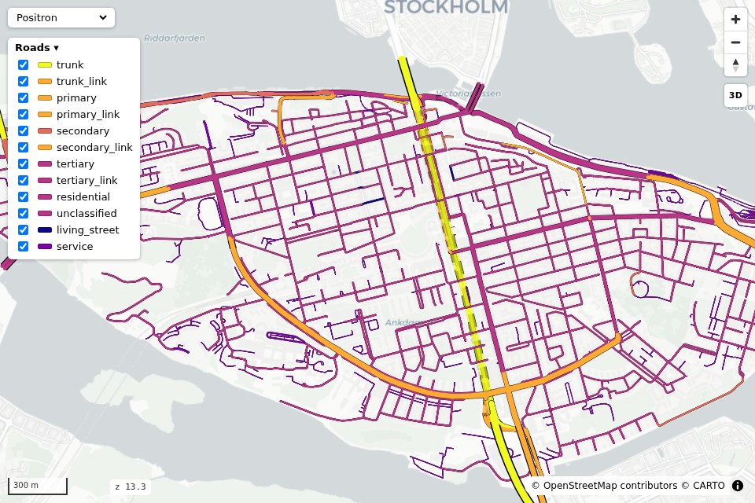
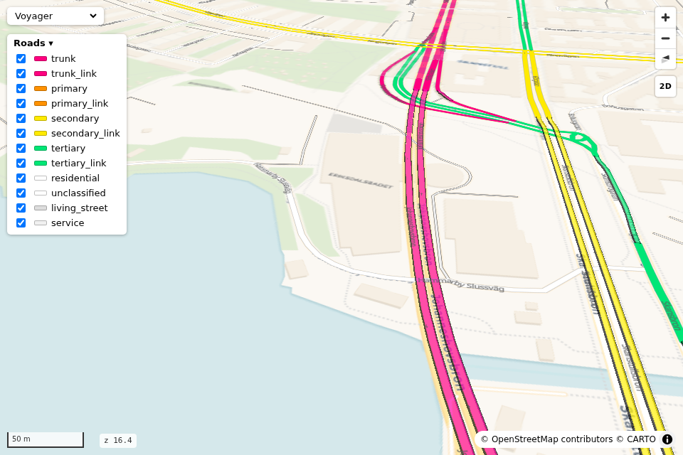
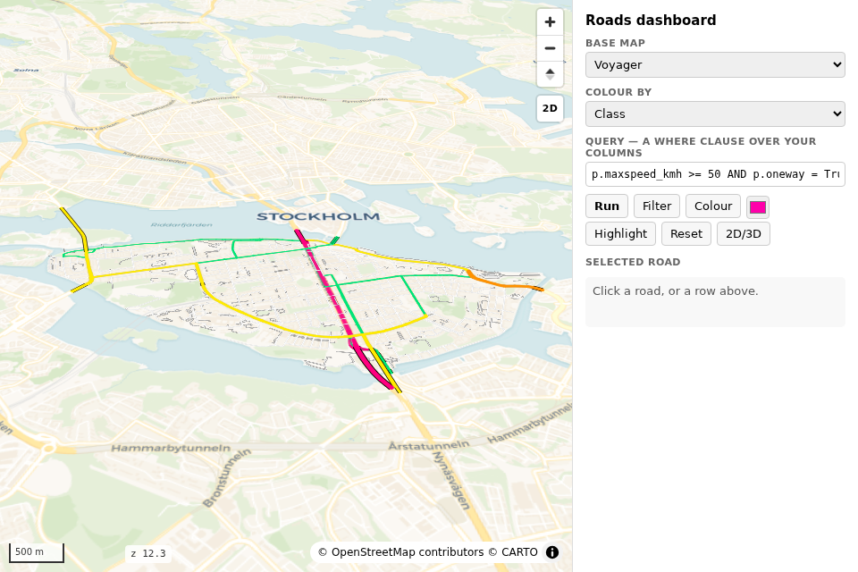

# Gallery

Every look below is the **Södermalm driving network** straight out of a duckOSM database — one
`rs.from_duckosm(...)` call, then `render_edges` with the keywords shown. Thumbnails are real
`rs.snapshot()` screenshots (regenerate with `python docs/build_gallery.py`).

```python
import roadstyle as rs
edges = rs.from_duckosm("sodermalm.duckdb")
```

## The defaults

`highsat` palette on the Voyager base — what you get with no arguments.

```python
rs.render_edges(edges)
```



## OSM-Carto on Positron

The classic muted openstreetmap-carto tones.

```python
rs.render_edges(edges, palette="carto", basemap="positron")
```



## Dark

```python
rs.render_edges(edges, basemap="dark_matter")
```



## Blank canvas (offline)

`mono` palette on the tile-less `blank` base map — zero network requests, print-clean.

```python
rs.render_edges(edges, palette="mono", basemap="blank", basemap_switcher=False)
```



## Satellite

```python
rs.render_edges(edges, basemap="satellite")
```



## Data-driven colour

Any numeric column → a colormap + legend (categorical mappings work too, see
[Palettes](palettes.md)).

```python
rs.render_edges(edges, color_by="maxspeed_kmh", cmap="plasma", legend=True, basemap="positron")
```



## 3D bridges

`view_3d=True`: tilted camera and extruded, ramped, black-cased bridge decks — look *under* a
bridge and see the roads passing beneath. Below zoom 16 bridges draw as classic flat cased lines
(`bridge_decks.flat_below`).

```python
rs.render_edges(edges, view_3d=True)
```



## The sidebar dashboard (UI template)

Every built-in control replaced by plain HTML driving the [JS API](web-backend.md#the-javascript-api-windowrs) —
query box, verb buttons, clickable results table, detail panel. Copy it from
[`ui/dashboard/`](https://github.com/Khoshkhah/roadstyle/tree/main/ui/dashboard).

```bash
python ui/dashboard/build.py your.duckdb
```


