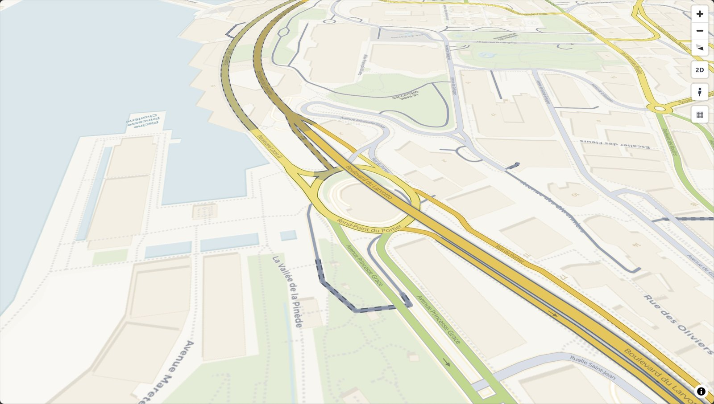
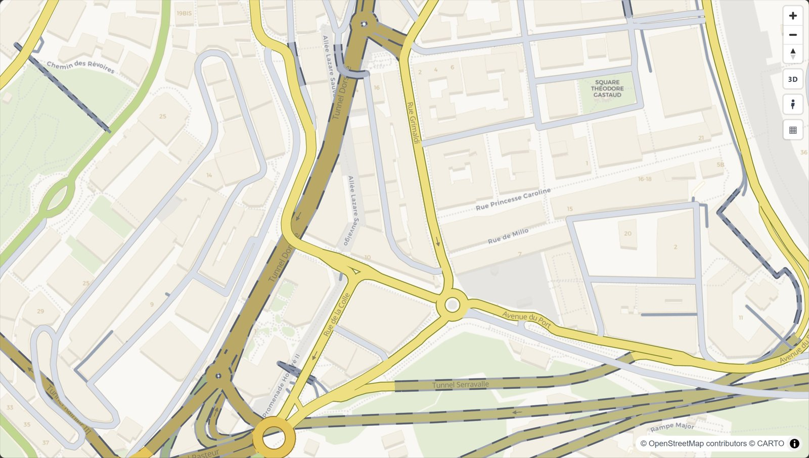
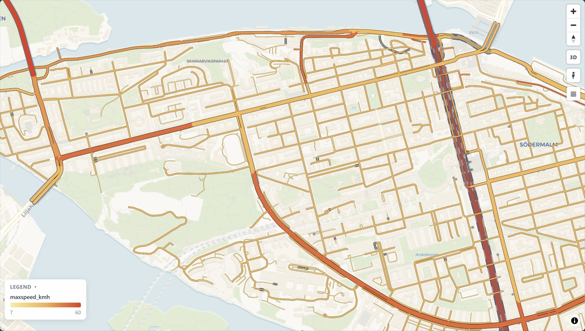
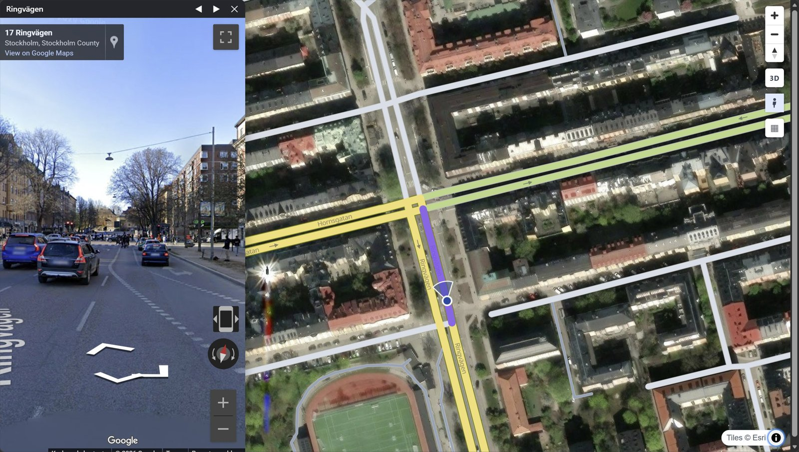
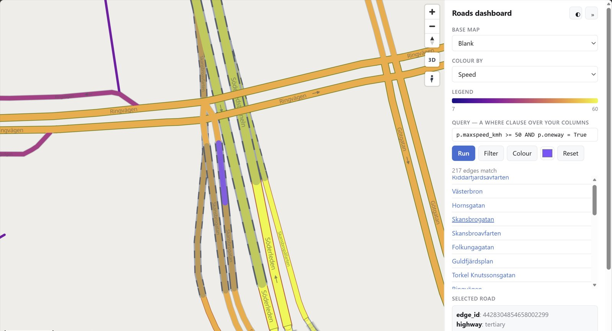
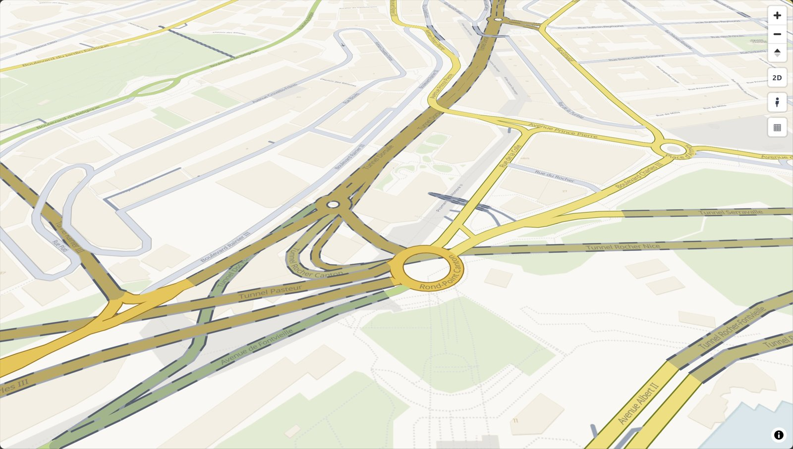

# Gallery

<p class="lead">What roadstyle can do, one thing per picture, with the line of code that makes it.</p>

The pictures are Södermalm (Stockholm) and Monaco, from OpenStreetMap:

```python
import geopandas as gpd
import roadstyle as rs
edges = gpd.read_file("ui/studio/samples/sodermalm_driving.geojson")   # Södermalm; Monaco is duckOSM's Monaco build
```

## The road map look

Outlines, street names along the roads and one-way arrows, out of the box.

```python
rs.render_edges(edges)
```


## Bridges and tunnels

A bridge has a slate outline and a soft shadow on what it crosses; a tunnel fades and has a dashed outline. The order is worked out for you.

```python
rs.render_edges(edges)
```



More in [Which road is on top](guides/levels.md).

## Stacked roads

Roads, ramps and tunnels crossing each other at several levels, each drawn in the right order. Any place can be fixed by hand in the
[level editor](guides/levels.md#fix-it-by-hand-the-level-editor).

```python
rs.render_edges(edges)
```



## Colour by your data

Any column, with a legend.

```python
rs.render_edges(edges, color_by="maxspeed_kmh", cmap="YlOrRd", legend=True)
```



More in [Colour by your data](guides/colour.md).

## 3D bridges

Bridges as raised decks over the roads that pass under them. Every map has a 2D/3D button.

```python
rs.render_edges(edges, view_3d=True)
```


## Street View

Click a road, then the Street View button: Google Street View of that road, in a window you can move.

```python
rs.render_edges(edges)                # the Street View button is on by default
```



More in [Google Street View](guides/street-view.md).

## Ready-made pages

A dashboard with base map, colour and query controls, in one call.

```python
rs.render_dashboard(edges, color_options={"Class": {}, "Speed": {"color_by": "maxspeed_kmh"}})
```



More in [Dashboards & JavaScript](guides/dashboards.md).

## Base maps

The same map on another background: Voyager (the default), Positron, Dark Matter, satellite, or a blank canvas that works offline.

```python
rs.render_edges(edges, basemap="blank")
```

<div class="grid" markdown>




</div>

More in [Style the roads](guides/style.md).
