# Gallery

<p class="lead">One look per entry: the keywords that make it, and a real screenshot.</p>

Every entry uses the bundled Södermalm sample:

```python
import geopandas as gpd
import roadstyle as rs
edges = gpd.read_file("ui/studio/samples/sodermalm_driving.geojson")
```

## The defaults

```python
rs.render_edges(edges)                # amber palette on Voyager
```

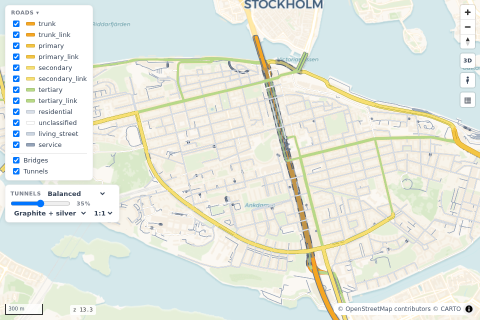

## High saturation

```python
rs.render_edges(edges, palette="highsat")
```

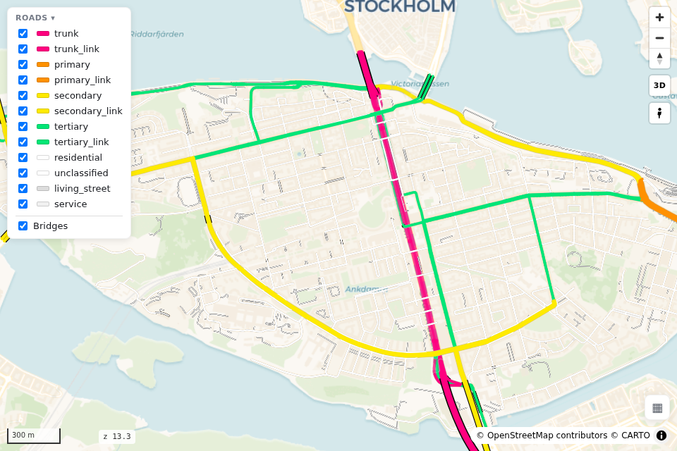

## OSM-Carto on Positron

```python
rs.render_edges(edges, palette="carto", basemap="positron")
```

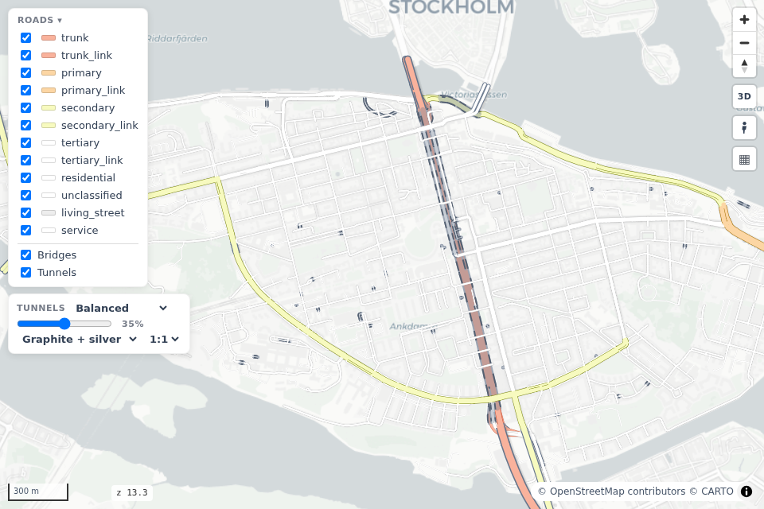

## Dark

```python
rs.render_edges(edges, basemap="dark_matter")
```

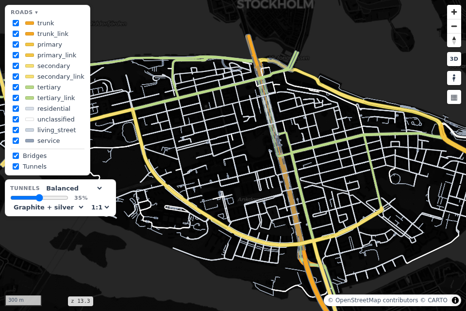

## Blank canvas (offline)

```python
rs.render_edges(edges, palette="mono", basemap="blank", basemap_switcher=False)
```

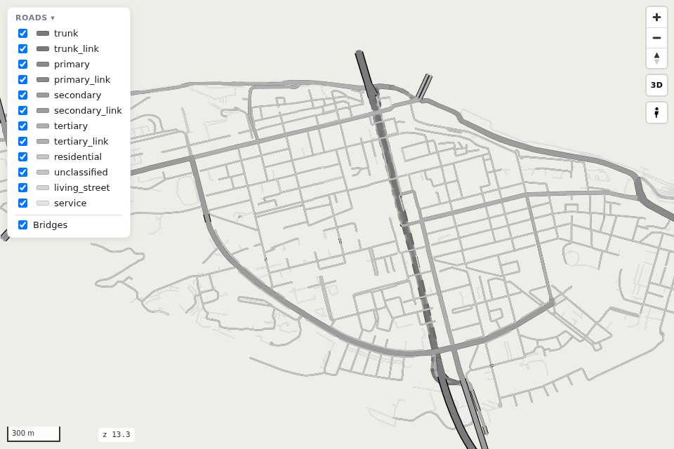

## Satellite

```python
rs.render_edges(edges, basemap="satellite")
```

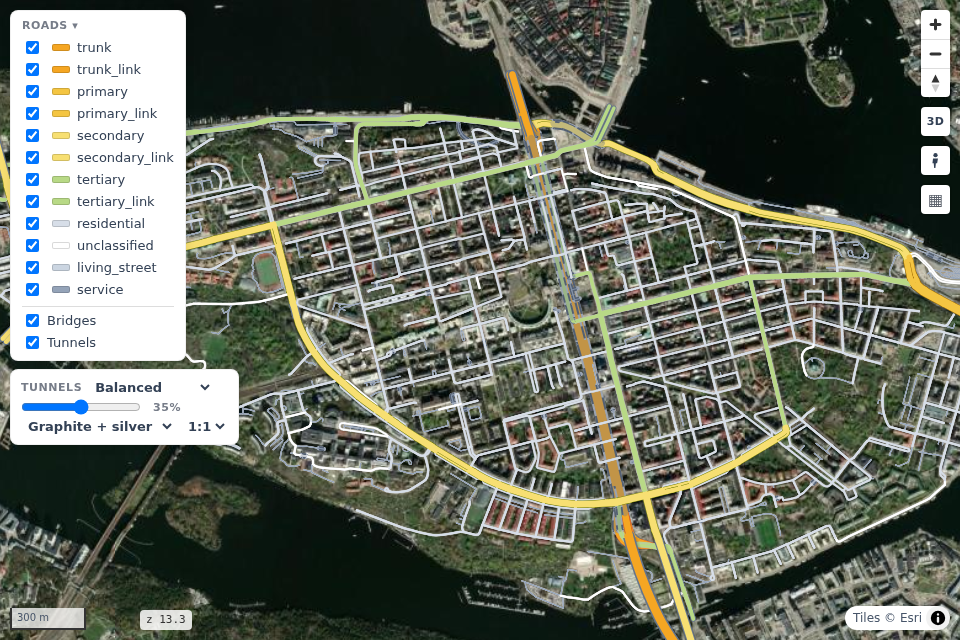

## Colour by data

```python
rs.render_edges(edges, color_by="maxspeed_kmh", cmap="plasma", basemap="positron")
```

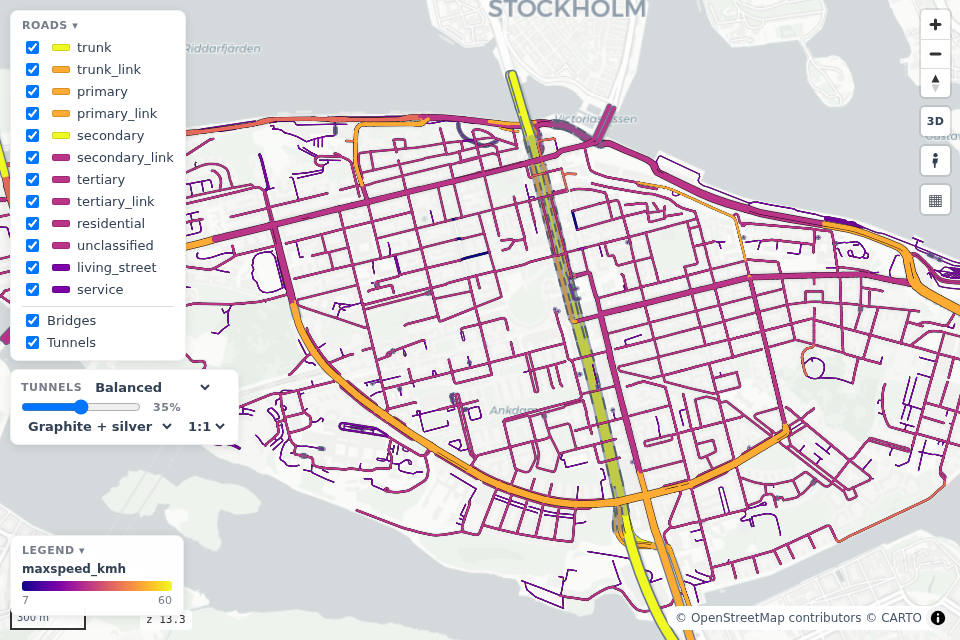

More in [Colour by your data](guides/colour.md).

## 3D bridges

```python
rs.render_edges(edges, view_3d=True)
```

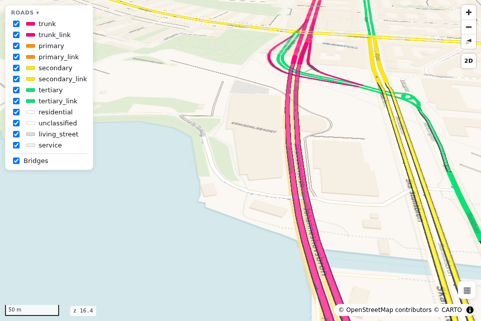

## Street View window

```python
rs.render_edges(edges)                # the Street View button is on by default
```

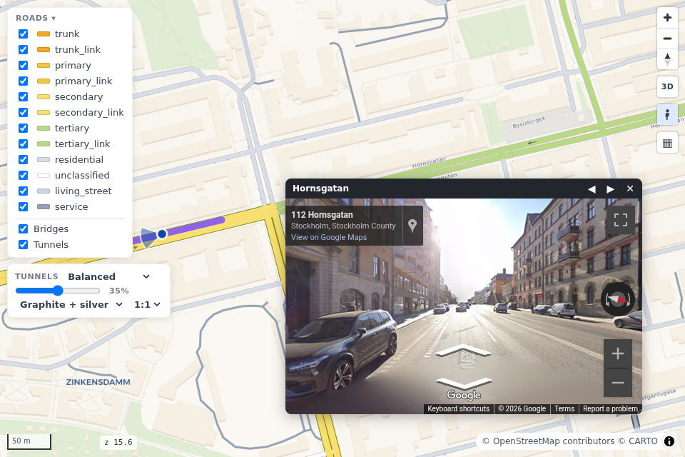

## Street View beside the map

```python
rs.render_street_view(edges)          # CLI: roadstyle edges.gpkg --page street-view
```

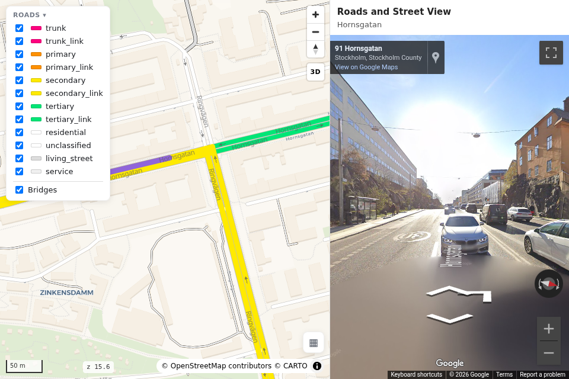

## Street View below the map

```python
rs.render_street_view(edges, layout="below")
```

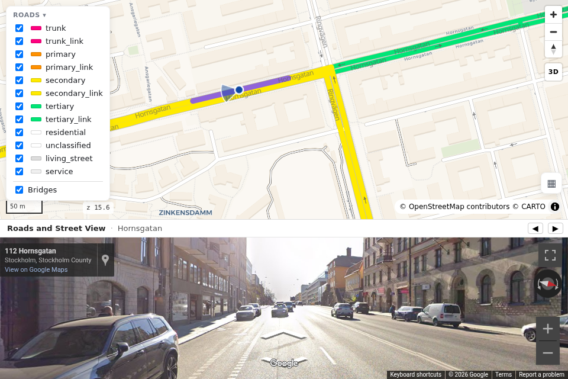

More in [Google Street View](guides/street-view.md).

## Dashboard

```python
rs.render_dashboard(edges).save("dashboard.html")   # CLI: --page dashboard
```

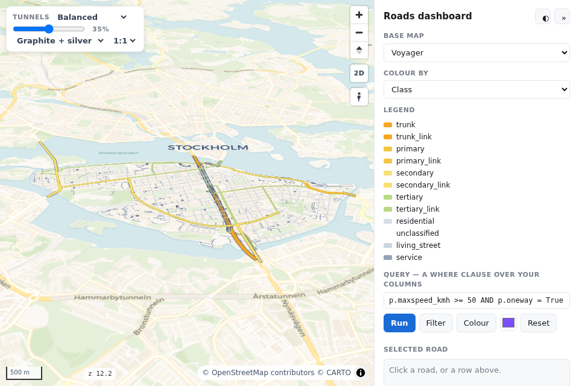

More in [Dashboards & JavaScript](guides/dashboards.md).

## Studio

```bash
pip install "roadstyle[studio]" && roadstyle studio
```

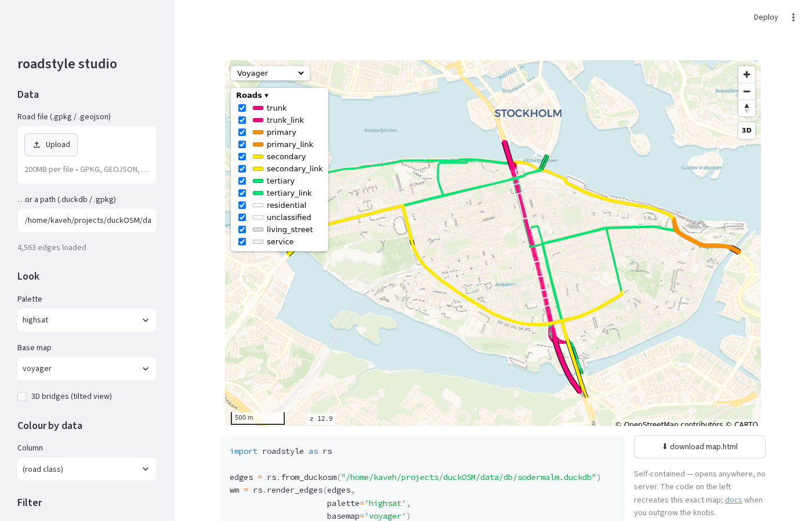

More in [Studio](studio.md).
