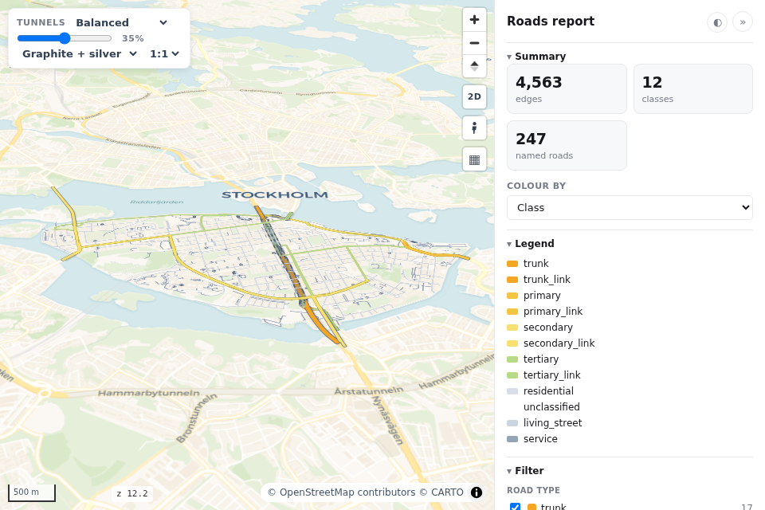

# Dashboards & JavaScript

<p class="lead">Get a finished dashboard or report page in one call, or put your own panel next to the map and drive it from JavaScript.</p>

=== "Python"

    ```python
    import roadstyle as rs

    rs.render_dashboard(edges, color_options={
        "Road class": {},
        "Speed": {"color_by": "maxspeed_kmh", "cmap": "plasma"},
    }).save("dashboard.html")
    rs.render_report(edges).save("report.html")
    rs.render_street_view(edges).save("street_view.html")
    ```

=== "Command line"

    ```bash
    roadstyle edges.gpkg --page dashboard -o dashboard.html
    roadstyle edges.gpkg --page report -o report.html
    roadstyle edges.gpkg --page street-view -o street_view.html
    ```

## Ready-made pages

| call | sidebar |
|---|---|
| `rs.render_dashboard` | base-map and colour selects, a class filter, a query box with a results table, a selected-road read-out |
| `rs.render_report` | headline numbers, the colour legend, a layer and class filter, search, a selected-road read-out |
| `rs.render_street_view` | Google Street View beside or below the map ([Google Street View](street-view.md)) |

Each takes every `render_edges` keyword and returns the same map object (`.save()`, `.html`).
`color_options` fills the *Colour by* picker; `name=` sets the page title.




To reshape a sidebar, `rs.sidebar_html("dashboard")` (or `"report"`) returns its HTML. Edit it
and insert it before `</body>` of a plain `render_edges` map.

## Drive the map from your own page

`m.html` is the saved page as a string. Put your panel before `</body>` and talk to the map
through the `window.rs*` functions:

```python
m = rs.render_edges(edges, palette="mono")
panel = """
<div id="side" style="position:fixed;top:0;right:0;bottom:0;width:400px;background:#fff"></div>
<style>#map{right:400px!important} body{--rs-side:400px}</style>
<script>
map.once("load", () => {                  // the roads are queryable once the map loads
  const ids = rsQuery(p => p.name === "Götgatan");
  rsColor(ids, "#e63946"); rsFocus(ids);
});
document.addEventListener("rs:select", e => {
  document.getElementById("side").textContent = JSON.stringify(e.detail.properties);
});
</script>"""
open("host.html", "w").write(m.html.replace("</body>", panel + "</body>"))
```

| call | does |
|---|---|
| `rsQuery(p => bool)` | the ids of the edges whose columns match |
| `rsColor(ids, "#hex")` / `rsColor(null)` | paint those edges / reset |
| `rsHighlight(ids)` | selection glow (`[]` clears) |
| `rsFocus(ids)` | fit the camera to them |
| `rsSelect(id)` | select one edge, like a click |
| `rs:select` event | `e.detail.properties` is the clicked edge's row; `e.detail.streetView` a Street View link facing its direction, or null |

!!! warning "Two traps"
    - **Ids past 2**53.** `rsSelect`, `rsColor` and `rsFocus` take roadstyle's ids, not your
      `edge_id`. Find them with `rsQuery(p => String(p.edge_id) === "8121729169906061189")`.
    - **A fixed side panel covers the map.** Inset it: `#map{right:400px!important}
      body{--rs-side:400px}`. The map's controls, the base-map button among them, move with it.

To show a set of edges, recolour them with `rsColor`; don't draw extra lines over the roads.
Pick a highlight colour that no `color_options` entry already uses.

**See also:** [JavaScript API](../reference/javascript.md) · [Command line](../reference/cli.md) · [Every parameter](../reference/parameters.md)
