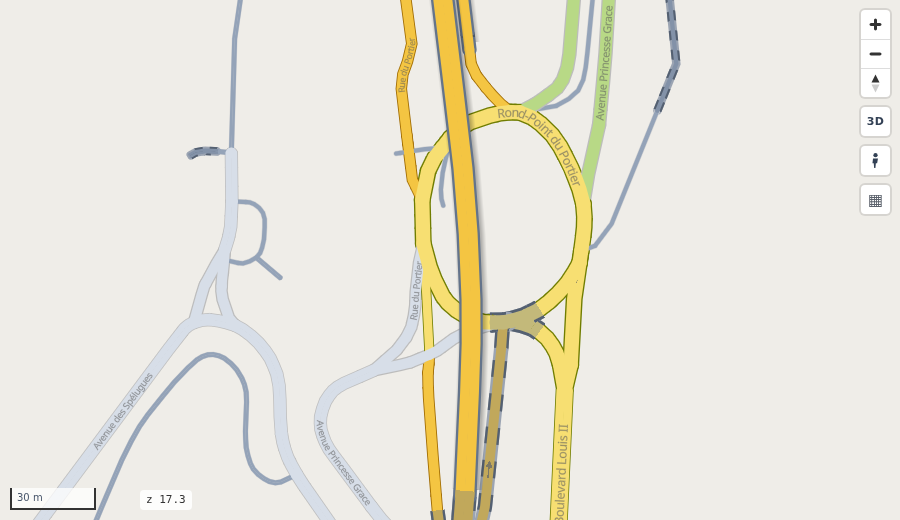
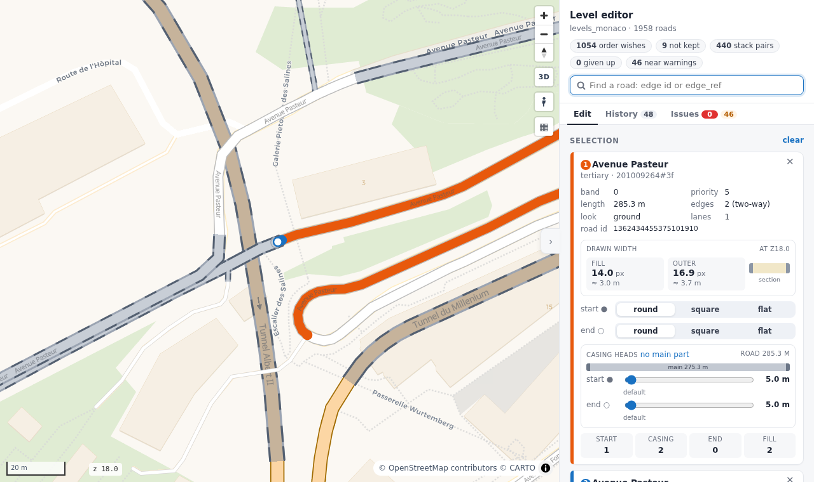

# Which road is on top

<p class="lead">Every edge gets numbers for where its outline and its road are drawn. The map is drawn by those numbers alone; a solver works them out, and an editor lets you fix any place by hand.</p>



Monaco, Rond-Point du Portier: the primary road crosses the roundabout on a bridge (slate outline, soft shadow), and a tunnel (dashed
outline) passes under both. Where the roads only meet, the roundabout is on top; where they cross, the bridge is.

=== "Python"

    ```python
    rs.render_edges(edges).save("map.html")    # the positions are computed for you
    ```

=== "Command line"

    ```bash
    # the level step with files you can read and edit (an area folder)
    roadstyle-levels make edges.gpkg out/area     # the solver's input
    roadstyle-levels solve out/area               # levels.csv
    roadstyle-levels edit out/area                # the editor, http://localhost:8780/
    ```

## The rule

- Every edge has a **casing position** and a **fill position**: whole numbers, 0 is the ground, null counts as 0.
- The casing has **three parts**: a start head, a main part and an end head, each with its own number (`casing_start`, `casing_level`,
  `casing_end`). The heads are 5 m long by default; on a short road the main part can have no length.
- The map is drawn position by position, lowest first. **At each position every outline is drawn first, then every road.**
- So two roads that meet at a junction merge without a ring: each head lies under the other road's fill.
- A road whose numbers are all higher than another's is drawn completely over it, outline included: an overpass.

**Nothing else orders the drawing**: not the road class, not `layer`, `bridge` or `tunnel`. They are only inputs of the solver.
Two edges at the *same* position are drawn in no set order.

## Where the numbers come from

The **level step** works them out, before drawing ([design](../design/level_input.md)). `render_edges(edges)` without level columns runs it
for you with its defaults. It has two halves:

1. **The input** (`rs.level_input(edges)`): one row per road (both directions together) and the pairs between roads.
   Roads of different bands (`layer`, `bridge`, `tunnel`) that **cross** become a *stack*: the higher band is over the lower one, written
   as one row per part of the upper road's casing that crosses (`start`, `main`, `end`), worked out here once with the heads of that time.
   Roads that **only meet** (a junction, a tunnel mouth, a bridge end) become an *order* wish: a roundabout over a tunnel, a tunnel over
   a bridge, a bridge over the road class. A roundabout is known by the OSM `junction` column: without it you get a warning.
2. **The solver** (`rs.solve_levels(roads, pairs, edits=...)`): whole numbers (integer programming with HiGHS), kept in this order:
   real crossings, then the order wishes, then as few positions as possible. The *near* rules (lifting the parts that only come close to the road
   under them) are **off by default since 2026-10-08**: on Monaco all modes they cost 45.9 s and 27 positions against 14.4 s and 9 without (and 1,477 of
   11,911 near rules broke anyway). Turn them on with `near_rules=True` (CLI: `make --near-rules`: they are written as `near` rows); an `edits.csv` stack is always a real rule.
   The solver reads only the tables, never the lines or the head lengths (2026-10-08): a head change needs no solve.

```python
levels = rs.compute_levels(edges)          # both halves in one call
rs.render_edges(levels, casing_start_col="casing_start", casing_level_col="casing_level",
                casing_end_col="casing_end", fill_level_col="fill_level").save("map.html")
```

Computing takes seconds for a district and longer for a big network: compute once, then draw with the columns.

## Fix it by hand: the level editor



`roadstyle-levels edit out/area` opens a local page with the map and a panel. Click a road, or find it by edge id or `edge_ref`;
pick a second one to see every pair between the two.

- **Add a relation**: *order* (whose fill is on top where they meet), *stack* (one over the other: pick the parts of its casing, *start
  head*, *main*, *end head*, one row each; *whole road* picks all three) or *meet* (join two ends). You choose which road is on top.
- **Switch off** a row the input found. Rows add up: your stack rows lift their parts on top of the found ones. To **override** a found
  stack, press *Switch off all found stack rows of this pair* (one switch-off per row), then add your own parts.
- **A guard before you add**: the page asks whether the new rule conflicts with the rules there are (found, yours, and the list) and names
  them: the same rule already there, or a loop (A over B, B's fill after C's, C over A: no numbers keep them all, so the solver would give
  one up). You can still add it.
- **Each end of a road**: its cap (*round*, *square*, *flat*) and its head length (a slider, in metres). The map shows each end's cap.
- Changes wait in a list until **Apply and solve**: they are solved together, and the open map redraws the roads that changed in place (more than 1,500 changed roads: the page reloads, and says so).
  If the solver refuses them, nothing is saved.
  A change of caps or heads is saved and drawn without a solve: they are drawing only. Which parts of a stack cross is decided when the
  area is made, with `heads.csv`'s heads; run `make` again to decide it with new heads.
- **Show only some modes**: when the roads have a `modes` column (who may use them, e.g. `driving + walking`; duckOSM gives it), boxes
  under the search show only the roads of the ticked modes (display only: every road is still solved). A road's card shows its modes.
- The **Issues** tab lists what to look at: **given up** (red: a real crossing the solver could not keep, a flaw on the map),
  **near warnings** (amber: two roads that only come close; only with near rules on, otherwise none) and the **order wishes not kept**.

Your changes live in three small tables in the area folder, never overwritten by the input step:

| file | what |
|---|---|
| `edits.csv` | your rows: `relation` (`order`, `stack`, `meet`), `a`, `b`, `a_end` (a stack's part: `start`, `main`, `end`), `b_end`, `enabled` (`false` switches that exact found row off) |
| `heads.csv` | head lengths per road end in metres (`road`, `start_m`, `end_m`; empty: 5 m); read by `make` for the stack rows |
| `caps.csv` | cap per road end (`road`, `start`, `end`: `round`, `square`, `flat`; empty: round) |

`levels.csv` is the result: per edge its four numbers and its ends as drawn (`head_start_m`, `head_end_m`, `cap_start`, `cap_end`).
An area made before 2026-10-08 has whole-road stack rows in `pairs.csv`: the solve stops and says to run `make` again (your three tables are
kept). An `edits.csv` stack with no part stops it too: give the row a part (or one row per part).
An example: Monaco's hand-made tables in `examples/levels/monaco/`.

### An area that belongs to a database

`make_area(edges, folder, db="monaco.duckdb")` ties the area to a DuckDB file (`area.json`): every solve, the editor's too, also writes
the result into it (`visualization.edge_levels`, with each edge's ends; `rs.save_area_levels`). `rs.load_area_levels(con, edges)` reads it
back for the same edges and stops with a message for any other edges. duckOSM's `duckosm levels monaco.duckdb` makes such an area for all
travel modes together (`monaco.levels/` next to the file), and mapstyle draws from it. Keep `edits.csv`, `heads.csv` and `caps.csv`: with
them a rebuilt file gets the same drawing order back.

Two edges on the same line are one road (its two directions) only when they are the same kind (`highway`, `tunnel`, `bridge`, `layer`): a
footway lying exactly on a street stays a road of its own.

## Bridges and tunnels

- A **bridge** has a slate casing (`bridge_casing_color`) and a soft **shadow** (`bridge_shadow`; in the full look shifted down-right, in simple mode, the default, blurred evenly around the bridge): each part of the
  bridge casts it at its own casing number, so it lies on what the bridge crosses, never on its own road. Hiding the bridges hides it too.
- A **tunnel** fades toward a chosen colour (`tunnel_toward`, default Sand), its fill, names, arrows and attached items alike: `tunnel_strength` (default 60; 0 is the normal colours, 100 the full tunnel
  colours) and, in the full look (`simple=False`), a two-colour dashed casing (`tunnel_palette`, default *Graphite + silver*). To try other values, `tunnel_control=True` adds a
  *Tunnels* box with its steps and colour list ; `rsSetTunnelStyle({strength, palette, ratio})` does the same from your page.

## Your own numbers

The solver is one way to fill the columns. Anything that gives whole numbers per edge works, for example a sidewalk at -1 under a street
at 0 and a crossing at 1 over it:

```python
edges["casing_level"] = edges["fill_level"] = edges["kind"].map({"sidewalk": -1, "street": 0, "crossing": 1})
```

To give your own band per edge and let the solver do the rest: `rs.compute_levels(edges, band_col="band")`.

## Good to know

- Each position that occurs gets its casing and fill layers (only those something is drawn by: no bridge layers without a bridge there), so keep the range small.
- `rsColor` and colour-by reach every position. `tiles=True` (with `simple=False`) works with positions.
- `render_edges` takes no band and no order: compute the levels first.

See also: [the level step, in full](../design/level_input.md) · [divided casing](../design/levels_split_casing.md) ·
[every parameter](../reference/parameters.md)
