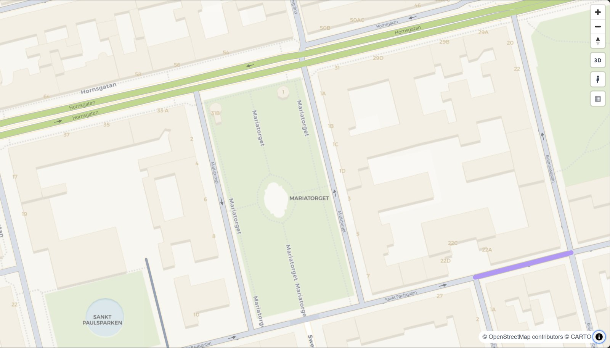
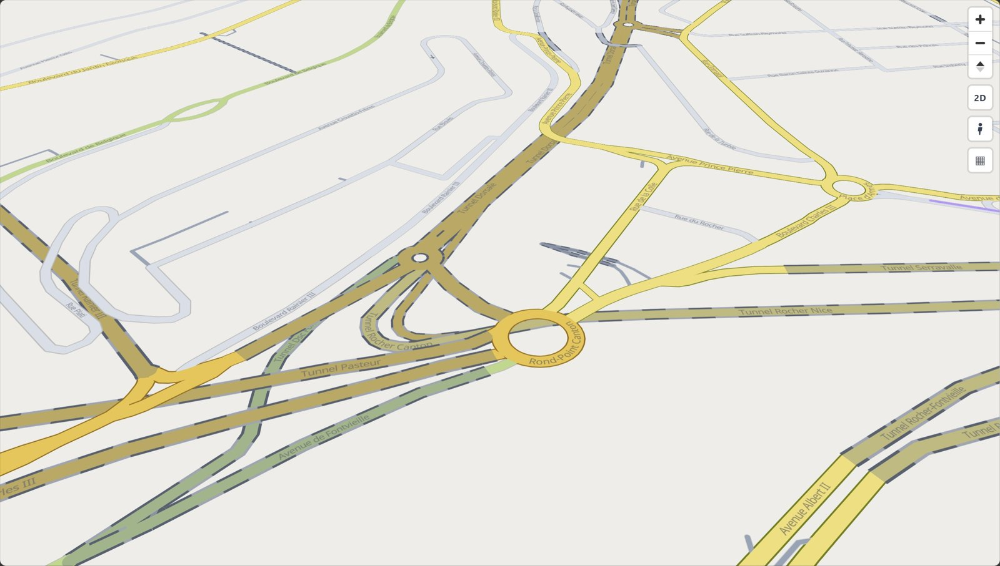
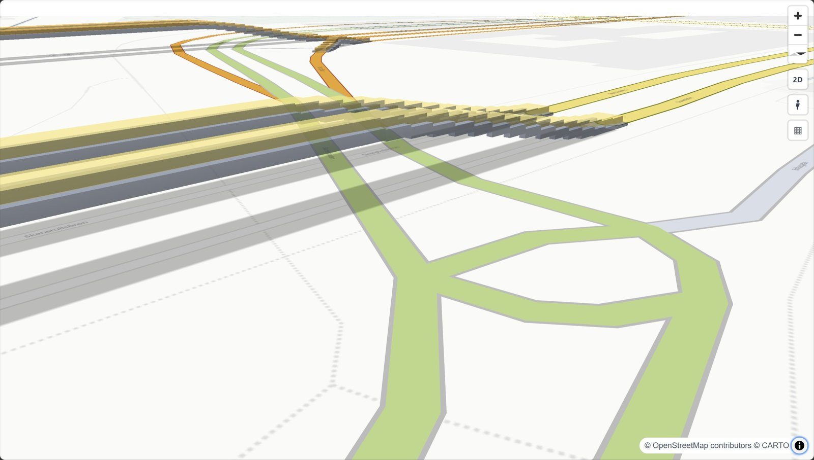

# Style the roads

<p class="lead">Pick a palette and a base map, switch the map's controls on or off, show bridges in 3D, and keep only the road classes you want.</p>

<iframe src="../../maps/first_map.html" loading="lazy" title="A map with the default style" class="rs-demo"></iframe>

=== "Python"

    ```python
    import geopandas as gpd
    import roadstyle as rs

    edges = gpd.read_file("edges.gpkg")
    rs.render_edges(edges, palette="carto", basemap="positron").save("map.html")   # the default is amber on Voyager
    ```

=== "Command line"

    ```bash
    roadstyle edges.gpkg --palette carto --basemap positron -o map.html
    ```

## Palettes

A palette sets each road class's colour, width and casing.

- `amber`: orange, yellow and green main roads, slate-grey streets. The default: every class stands out on a light base map.
- `carto`: the muted colours of the OpenStreetMap standard map.
- `highsat`: bright, high contrast.
- `mono`: shades of grey. Use it under your own data colours.

<div class="grid" markdown>





</div>

To change a class's colour or add a palette, see [Settings & palettes](../reference/settings.md).

## Base maps

`basemap=` sets the background, `basemaps=` sets the list in the base-map switcher (bottom-right).

```python
rs.render_edges(edges, basemap="dark_matter", basemaps=["dark_matter", "positron", "satellite"])
rs.render_edges(edges, palette="mono", basemap="blank")      # no tiles: works offline
```

- `voyager` (the default), `positron`, `dark_matter`: CARTO.
- `osm`, `esri_gray`, `esri_street`, `esri_dark_gray`: no key needed.
- `satellite`: Esri World Imagery.
- `blank`, `blank_dark`: a plain canvas with no network requests, so the file works offline.

!!! note "CARTO needs a free key"
    Without one, CARTO tiles show an "API KEY REQUIRED" watermark. Set a key or use a keyless
    base map: [Base maps & API keys](../reference/settings.md#base-maps-api-keys).

## Map controls

Labels, one-way arrows, the road-class filter panel and the base-map switcher are all on by
default. Turn any of them off:

```python
rs.render_edges(edges, labels=False, arrows=False, filter_control=False, basemap_switcher=False)
```

On the command line: `--no-labels`, `--no-arrows`, `--no-filter`, `--no-basemap-switcher`.

## 3D bridges

`view_3d=True` tilts the camera and draws bridges as raised decks, so you can see the roads that
pass under them. Every map also has a 2D/3D button. Below zoom 16 bridges draw flat.

```python
rs.render_edges(edges, view_3d=True)                         # CLI: --view-3d
```



In 2D a bridge has a slate casing and a soft shadow; a tunnel fades toward a chosen colour (with `simple=False` it also has a dashed casing)
([Which road is on top](levels.md#bridges-and-tunnels)).

## Keep or drop road classes

```python
rs.highway_types(edges)                                      # the classes in your data
rs.render_edges(edges, include=["motorway", "trunk", "primary", "secondary"])
rs.render_edges(edges, exclude=["service", "footway", "path", "cycleway"])
rs.render_edges(edges, minzoom=True)                         # hide minor classes when zoomed out
```

`include` and `exclude` also keep or drop the `*_link` ramps of each class (`match_links=True`).
`minzoom` can also be a dict such as `{"residential": 14}` to change the zoom for some classes.

## Your own road classes

For a class column that is not OSM `highway` (say NVDB functional classes), register a palette of
`RoadStyle(fill, width, casing_width)` per class and style by that column:

```python
from roadstyle import RoadStyle, color_by_class, register_palette

register_palette("nvdb", {"0": RoadStyle("#00E5FF", 6, 8), "1": RoadStyle("#FF9100", 4.5, 6.5)})
rs.render_edges(edges, style=color_by_class("functional_road_class", palette="nvdb",
                                            normalize_links=False))
```

`save_palette` / `load_palette` keep it as JSON ([Settings & palettes](../reference/settings.md)).

**See also:** [Every parameter](../reference/parameters.md) · [Settings & palettes](../reference/settings.md) · [Gallery](../gallery.md) · [JavaScript API](../reference/javascript.md) (`rsSetBasemap`, `rsSetClasses`, `rsSetView3D`)
