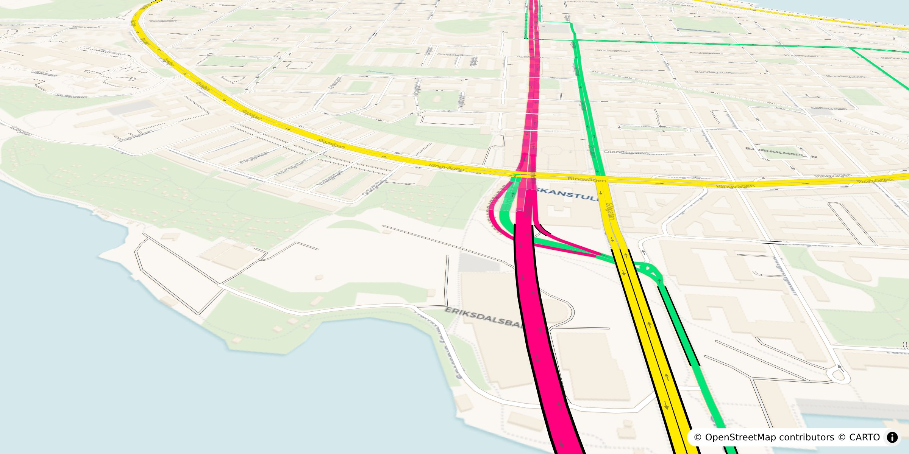

# roadstyle

**roadstyle** turns a GeoDataFrame of road edges into one styled, interactive HTML map: OSM-style
road cartography (coloured fills over casings, two-way lanes, arrows, bridges over tunnels), your
own data as colour, and a `window.rs*` JavaScript API. The file is self-contained (MapLibre and the
data inlined), so it opens offline with no server.



```python
import geopandas as gpd
import roadstyle as rs

edges = gpd.read_file("edges.gpkg")                      # any CRS; needs a `highway` column
rs.render_edges(edges).save("roads.html")                # classic road styling, done

rs.render_edges(edges, palette="mono",                   # colour by your own column
                color_by="aadt", cmap="viridis", width_by=(1, 6)).save("traffic.html")
```

- **Real road cartography**: per-zoom widths, directed two-way lanes, street names, tunnel/bridge
  grade separation, a 3D view (`view_3d=True`).
- **Your data as colour**: categorical or numeric columns, legends, and several switchable
  "colour by" options in one map.
- **Scriptable**: every control has a `window.rs*` twin, plus `rsQuery` id sets and `rs:*` events.
- **Other outputs**: folium, lonboard (GPU, millions of edges), or a JSON spec for your own frontend.
- **No code needed**: the `roadstyle` CLI and the `roadstyle studio` workbench.

## Install

Python ≥ 3.10.

```bash
pip install roadstyle                 # geopandas, shapely, folium, branca come along
pip install "roadstyle[studio]"       # + the no-code workbench: `roadstyle studio`
```

Every optional feature is an extra; combine what you need (`pip install "roadstyle[numeric,tiles]"`)
or take them all with `pip install "roadstyle[all]"`.

| Extra | Enables | Pulls in |
|---|---|---|
| `studio` | `roadstyle studio`, the interactive Streamlit workbench | streamlit |
| `numeric` | continuous colour ramps + classification (`color_by` on numbers, `cmap`) | mapclassify, matplotlib |
| `tiles` | `tiles=True`, embedded vector tiles for big networks | mapbox-vector-tile, pmtiles |
| `lonboard` | the GPU (WebGL) backend for very large edge sets | lonboard |
| `duckdb` | `from_duckdb()`, edges straight from a DuckDB query | duckdb |
| `arrow` | edges from a pyarrow Table | pyarrow |
| `basemaps` | any xyzservices tile provider as a base map | xyzservices |
| `all` | every extra above | all of the above |

The latest unreleased state, still without cloning (extras combine the same way; bare
`roadstyle @ git+…` is core only):

```bash
pip install "roadstyle[all] @ git+https://github.com/Khoshkhah/roadstyle.git"
```

**Developing on it** (clone + editable, a src layout):

```bash
git clone https://github.com/Khoshkhah/roadstyle.git && cd roadstyle
pip install -e ".[dev]"              # every extra (incl. the studio) + pytest/ruff/mypy
# or: conda env create -f environment.yml && conda activate roadstyle && pip install -e ".[dev]"
pytest                               # browser tests need `pip install playwright`
```

From a checkout the studio runs against your working tree and uses the sample data in
`ui/studio/samples/` directly.

**Uninstall:** `pip uninstall roadstyle`. Your settings overrides (`~/.config/roadstyle/roadstyle.json`,
a project-local `roadstyle.json`) are your files; pip leaves them in place.

## Command line

No Python needed: `roadstyle` renders any road file straight from the shell.

```bash
roadstyle edges.gpkg -o map.html --basemap dark_matter               # styled interactive map
roadstyle edges.gpkg --palette carto --basemap positron              # palette: highsat | carto | mono
roadstyle edges.gpkg --include motorway trunk primary                # keep only major roads
roadstyle edges.gpkg --color-by aadt --cmap viridis --width-by 1 6   # colour by your data
roadstyle edges.gpkg --page street-view                              # map + Google Street View
roadstyle edges.gpkg -f spec -o map_data.json                        # JSON spec for your own frontend

roadstyle studio                                                     # the Streamlit workbench
roadstyle studio --server.port 8502                                  # extra args go to streamlit
```

`-f/--format` is one of `web` (self-contained MapLibre map, the default), `folium`, `rsjs`
(roadstyle.js page), `spec`, `geojson`. Every other flag mirrors a `render_edges` keyword; the `web`
map also takes `--no-arrows` / `--no-labels` / `--no-filter` / `--no-basemap-switcher`, and
`--page dashboard | report | street-view` for a ready-made page (`--panel-width`, `--no-resize` for
the street-view one). See
`roadstyle --help`. `roadstyle studio` needs the `studio` extra and forwards extra arguments to
`streamlit run`.

## Where to next

- **[Manual](manual.md)**: the walk-through, with live maps, notebooks and example scripts.
- **[Gallery](gallery.md)**: one screenshot + recipe per look.
- **[Studio](studio.md)**: the no-code Streamlit workbench.
- **[Web backend](web-backend.md)**: the MapLibre map in full, and its JavaScript API.
- **[Embedding](embedding.md)**: iframe, JSON spec, `roadstyle.js`, your own frontend.
- **[Engines](engines.md)**: web vs folium vs lonboard, and roadstyle vs other tools.
- **[Parameters](parameters.md)**: every keyword and public function.
- **[Palettes](palettes.md)**: palettes, settings, base maps and API keys.
