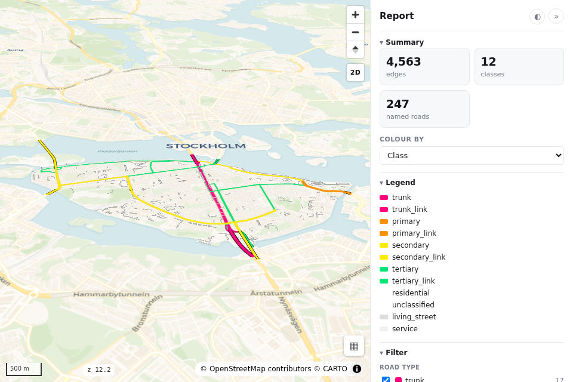

# Studio (Streamlit workbench)

**roadstyle studio** is the gentlest way to work with — and demo — the library: point it at a road
file, click through the knobs, and watch the live map update next to the **exact `render_edges` code**
that produces it. Every page has a download button for the self-contained HTML.

```bash
pip install streamlit          # the studio's only extra dependency
streamlit run ui/studio/app.py
```

The map itself is plain roadstyle; Streamlit only draws the knobs. It opens on the **Map** page and
carries a page switcher for three products — **Map**, **Dashboard**, **Report**.

## Map

The whole library behind a few knobs. Load a road file (or a bundled Södermalm sample), then set:

- **Look** — palette, base map, 3D bridges (tilted view), and vector tiles (embedded PMTiles for big
  networks, when the [`tiles` extra](web-backend.md#vector-tiles-in-the-file-tilestrue) is installed).
- **Colour by data** — recolour by any column with a colormap.
- **Filter** — keep a subset of road classes; hide minor classes when zoomed out (`minzoom`).
- **Decorations** — street-name labels, one-way arrows.
- **Popup & hover** — the click popup (curated / chosen columns / side panel / all / off) and a
  hover tooltip.
- **Overlays** — bring zones / POIs / lines as extra layers.

The live map sits beside the exact `render_edges(...)` call for the current state — copy it out when
you outgrow the knobs, or download `map.html`.

## Dashboard

The same knobs, but the product is the **query sidebar**
([`ui/dashboard`](https://github.com/Khoshkhah/roadstyle/tree/main/ui/dashboard)): the map rendered
with the built-in controls off and the sidebar injected — a query box, filter / colour / highlight
buttons, a results table, and a detail panel, all driven through the public `window.rs*` API. Pick
the base maps, colour-by columns and hover tooltip, preview it live, and download `dashboard.html`.

## Report

The same again, but the product is the **report sidebar**
([`ui/report`](https://github.com/Khoshkhah/roadstyle/tree/main/ui/report)): KPI cards (edges /
classes / named roads / length), the active colour-by legend, a checkbox filter (overlay layers +
road types), a search box, and a selected-road read-out — a stats-forward panel whose every number
is computed client-side from the baked edges. The base map keeps the map's on-map switcher icon.
Download `report.html`.



!!! tip "The sidebar pages are authoring tools"
    Dashboard and Report just pick the knobs and inject one of the copyable
    [`ui/` templates](frontend.md); the HTML / CSS / JS fragment is yours to reshape. Everything the
    sidebars do goes through the documented [`window.rs*` API](web-backend.md#the-javascript-api-windowrs).
