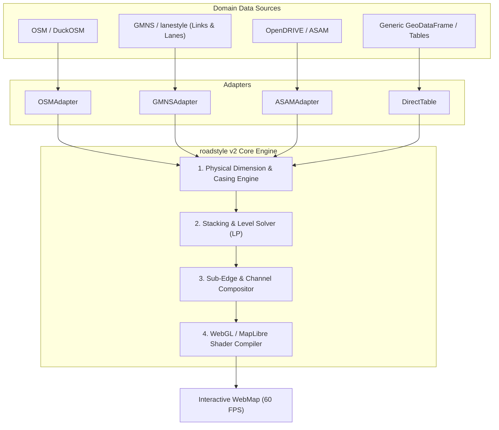
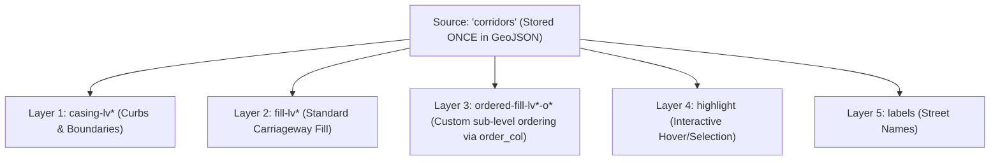

# roadstyle v2: Architecture & General Design

**Status:** Design Draft (Active)  
**Authors:** Kaveh & Antigravity  
**Target:** Next-generation decoupled cartographic engine for multi-modal transport networks.  
**Visual Blueprints:** See [Multi-View Architectural Blueprint](architecture_views.md) for full flowcharts and diagrams.

---

## 1. Executive Summary & Vision

The core mission of `roadstyle` is to turn transport network graphs (links, carriageways, lanes, junctions, grade separations) into publication-grade, interactive, 60 FPS WebGL vector maps.

In `roadstyle` v1, cartographic capabilities (casing, fill, bridge decks, tunnel portals, LP level solver, MapLibre layer compilation) were partially coupled with OpenStreetMap (OSM) assumptions (e.g., fixed `highway` classes, uniform `casing_m = 0.15`, and a global fixed split scalar `head_m = 5.0`).

**`roadstyle` v2 introduces a clean architectural decoupling:**
1. **The Core Engine**: A pure, domain-agnostic, mathematically sound cartographic compiler that operates solely on universal physical and topological primitives.
2. **The Adapters**: Thin, interchangeable translation layers that map domain-specific data models (OSM, DuckOSM, GMNS / `lanestyle`, OpenDRIVE, GIS tables) into the engine's generic primitives.



---

## 2. Core Engine Primitives (The Universal Contract)

The engine does not recognize "motorways" or "roundabouts". It recognizes four universal primitives:

### Primitive 1: Corridors (Edges / Carriageways)
A corridor is a 1D reference polyline (`LineString`) with real-world dimensions:
* `geometry`: `LineString` (EPSG:4326)
* `width_m`: Carriageway physical width in meters (or `width_px` for pixel mode).
* `casing_m`: Curb / barrier thickness in meters. **Fully data-driven per-row** (e.g. 0.2m curb vs 0.5m barrier).
* `casing_splits`: Two numbers per row $(c_1, c_2)$ specifying junction transition boundaries.
* `fill_visible`: `bool` (whether to paint a solid road body, or keep it hollow for sub-elements/lanes).

### Primitive 2: Sub-Elements (Lanes, Markings, Overlays)
Items that live inside or attached to a corridor:
* **Channel / Lane**: Reference line + physical width (`LineString + width_m`), rendered as GPU line strokes with zoom scaling.
* **Demarcation / Marking**: Thin stroked lines (`LineString + stroke_px`, dashes, colors) for divider lines, stop lines, curbs.
* **Surface Patch**: 2D `Polygon` for irregular planar features (painted traffic islands, crosswalk zebras, junction fillets).
* **Symbol / Point**: `Point` for lane arrows, icons, and text labels.

### Primitive 3: Topological Stacking & Grade Separation
* `band`: Vertical grade tier (e.g. tunnel $-1$, ground $0$, bridge $+1$, flyover $+2$).
* `junction_priority`: Relative order when edges meet at a grade-level junction (e.g. ring over approach, major road over minor).
* Output: Exact discrete casing levels (`cs, cm, ce`) and fill levels (`fl`).

### Primitive 4: Visual Theme (Style Tokens)
Pure styling rules: color palettes, zoom scaling curves, dash array dictionaries, opacity rules.

---

## 3. The Casing Engine: Why 1D Line + Width Wins

A core design decision in v2 is: **Casing is represented as 1D Line + Width, NOT 2D Polygons.**

### Comparison

| Dimension | 1D Line + Width | 2D Pre-buffered Polygon |
| :--- | :--- | :--- |
| **Payload Size** | ~45 bytes / segment | ~115 bytes / segment (~2.5×) |
| **GPU Triangles** | 2 triangles (quad strip) | 2 triangles (triangulated) |
| **Intersection Seams** | **Natural**: Ends stay open; shared nodes blend seamlessly | **Broken**: Strokes all 4 sides, drawing a curb across intersection entrances |
| **2-Point Split Math** | **Trivial**: 1D linear projection ($s_1, s_2$) | **Complex**: Requires 2D cutting planes |
| **Zoom Adaptability** | **Dynamic**: Clamps to min pixels at low zoom | **Static**: Collapses to sub-pixel dust at low zoom |
| **Dynamic Restyling** | **Instant**: Update shader uniform, 0ms recalculation | **Slow**: Must re-buffer geometry in Python |

**Conclusion:** 1D Line + Width provides maximum generality, minimal payload, and superior cartographic behavior at intersections. Polygons are reserved exclusively for irregular planar patches (fillets, islands).

---

## 4. The 2-Point Casing Splitter

In v1, casing splitting was controlled by a single global scalar `head_m = 5.0`, forcing both ends of every road to split at $h = \min(5.0, L/2)$.

In v2, every row can specify its own **two split numbers**:

```
[Start Node u] ═══════════╦═════════════════════════════════╦═══════════ [End Node v]
   (Level: cs)            ║           (Level: cm)           ║    (Level: ce)
  0 ────────────► cut_1   ║   cut_1 ────────────────► cut_2 ║  cut_2 ────────────► L
```

### Split Modes Supported:
1. **Mode A: Head Setbacks from Ends $(h_{\text{start}}, h_{\text{end}})$**
   * $c_1 = h_{\text{start}}$: Setback in meters from start node.
   * $c_2 = h_{\text{end}}$: Setback in meters from end node.
   * $\text{cut}_1 = h_{\text{start}}, \quad \text{cut}_2 = L - h_{\text{end}}$.
   * Short road handling ($h_{\text{start}} + h_{\text{end}} > L$): Scales proportionally to meet at midpoint; middle piece drops out.
2. **Mode B: Polyline Stations $(s_1, s_2)$**
   * Absolute distances along polyline from vertex 0: $\text{cut}_1 = s_1, \text{cut}_2 = s_2$.

The main piece carries flat ends (`line-cap: butt`), while the junction heads carry round ends (`line-cap: round`) to blend seamlessly into intersecting roads.

---

## 5. Single-Source, Multi-Layer Pipeline: Zero Data Duplication

A critical efficiency flaw in `roadstyle` v1 was that passing an `Overlay` attached to roads (e.g. `Overlay(roads, edge_col="edge_id")`) blindly serialized the entire road network a second time into a new GeoJSON source (`ov0`). This doubled the HTML payload and GPU memory.

In `roadstyle` v2, the engine strictly decouples **Data Sources (Tables)** from **Visual Layers (Render Passes)**:



### The v2 Single-Source Principles:
1. **The Geometry is Packaged Exactly Once**: All road corridors live in `sources["corridors"]`.
2. **Layers are Free**: In WebGL/MapLibre, five layers reading from the same source cost zero additional network transfer and negligible GPU vertex memory.
3. **Sub-Level Ordering without Duplication**: If a caller wants fine-grained `order_col` ordering among roads at the same elevation level, the engine compiles multiple shader layers against `sources["corridors"]` using filter expressions (`["==", ["get", "order"], o]`) rather than duplicating the GeoJSON.
4. **Result**: 50% reduction in GeoJSON payload, 50% less browser memory, and instantaneous tile parsing.

---

## 6. Sub-Edge Compositing: Normal Roads vs. `road_fill=False`

`roadstyle` v2 natively supports two compositing modes:

1. **Standard Highway / Regional Mode (`road_fill=True`)**:
   * The corridor fills its own interior directly from the road table.
   * Minimal layer count, maximum performance for nationwide / city-wide basemaps.
2. **Microscopic Lane / Item Mode (`road_fill=False`)**:
   * The corridor draws only its outer casing (curbs/boundaries).
   * The interior is populated by child Channels (lanes) and Demarcations (markings).
   * Enables complete microscopic cartography without duplicating road geometry.
   * **Clean Hit-Testing**: Rather than keeping an invisible phantom layer with `line-opacity: 0`, v2 provides explicit interactive target layers and category slots (`CASING_SLOT`, `FILL_SLOT`, `OVERLAY_SLOT`).

---

## 7. Special Topological Topologies: Dead Ends (Cul-de-Sacs) & Roundabouts

Network graphs contain non-trivial boundary topologies where standard continuous corridor rendering requires specialized geometric and stacking handling:

### 7.1 Dead-End Twins & Cul-de-Sacs (The "ω-Notch" Problem)

In two-way road modeling, a physical street is often represented by two opposite directed edges (twins: $A \to B$ and $B \to A$). At street-level zoom ($z \ge 15$), cartographic renderers fan both lines laterally to display distinct directional lanes.

#### The Legacy v1 Problem:
* Each fanned line had its own independent rounded line cap (`line-cap: round`).
* At a dead end or cul-de-sac, this caused the street to terminate in **two half-width bumps with an ugly notch/dip in the middle** (resembling an "ω" shape) instead of a smooth, continuous street end.
* Merging the lines into one was prohibited because each direction required independent selection, hover tooltips, and directional traffic coloring.
* **The v1 Workaround ("Blob" End Caps)**: `roadstyle` v1 introduced a synthetic `Point` layer (`twin_end_caps` / `_twin_ends`) generating two concentric circle layers (`roads-ends-casing` and `roads-ends-fill`) at each shared twin endpoint. This circle blob sat under the lanes to fill the dip. However, it required complex edge-case handling:
  - *Tunnel mouths / Lower bands (`__rs_nocase`)*: Omitted the casing ring to avoid slicing across underpasses.
  - *Directional recoloring*: Only rendered when both lanes had the exact same color.
  - *Payload bloat*: Added up to 12,500 extra point features in metropolitan networks.

#### The v2 Solution (Unified Corridor Envelopes & Patch Bulbs):
1. **Parent Envelope**: In v2, the `Corridor` primitive represents the entire physical roadway envelope (both lanes + casing curbs). The corridor's casing naturally terminates in a single, smooth round cap (`line-cap: round`), seamlessly bounding both internal lane channels.
2. **True Cul-de-Sac Bulbs via `Patch`**: For suburban cul-de-sacs with an expanded bulbous turnaround circle (e.g. radius 12m), the turnaround is modeled directly as a 2D planar `Patch` polygon with `order: -1`, underlaying the corridor and eliminating synthetic point-blob hacks.

```
Legacy v1 (Uncapped Dip vs Blob):       roadstyle v2 (Corridor Envelope):
    ┌──────────┐ ╮                          ┌────────────────────┐ ╮
    │  Lane A  │ │                          │      Channel A     │ │
    ├──────────┤ ├─ Dip without cap         ├┄┄┄┄┄┄┄┄┄┄┄┄┄┄┄┄┄┄┄┄┤ ├─ Smooth Corridor
    │  Lane B  │ │  (or circle blob)        │      Channel B     │ │  Casing Cap
    └──────────┘ ╯                          └────────────────────┘ ╯
```

---

### 7.2 Roundabouts (Circulating Rings vs. Radial Arms)

A roundabout consists of a closed circulating loop intersected by multiple radial approach and departure road arms.

#### The Legacy Problem (Cap Spill & Color Bleeding):
* In standard network drawings, approach road centerlines connect directly to nodes on the circulating roundabout ring.
* When approach arms and the circulating ring have equal cartographic classification (e.g. both `primary` or `residential`) or when an approach arm carries transit/walking (e.g. green fill), the approach arm's round line cap painted **directly on top of the circulating ring** (observed in Monaco: *"the green colour went to the roundabout"*).
* This severed the circulating ring lanes, creating circular color blotches and visual breaks across the roundabout carriageway.

#### The v2 Multi-Level Solution:
1. **Topological Dominance in the LP Stacking Solver**:
   - The circulating ring edge is assigned a mandatory higher priority constraint over entering/exiting approach arms:
     $$\text{fill\_level}(\text{ring}) > \text{fill\_level}(\text{arm})$$
   - This guarantees that the continuous circulating pavement and spiral demarcations paint uninterrupted over all approach arms.
2. **Asymmetric Junction Setbacks (`split_start` / `split_end`)**:
   - Approach arm corridors receive a setback cut ($s \approx 10\text{m} - 15\text{m}$) at the roundabout perimeter node.
   - This stops the approach arm's outer curb casing from piercing through the circulating carriageway, leaving the junction portal cleanly open.
3. **Central Island as a `Patch`**:
   - The roundabout center is modeled as a 2D polygonal `Patch` (e.g. landscaping green, decorative paving, or truck apron).
   - Rendered with `order: -1`, cleanly underlying the inner curb casing of the circulating corridor without requiring complex closed polygon buffer calculations.
4. **Corner Curb Return Fillets**:
   - Flare curb returns where approach arms enter and exit the circulating ring are rendered using 2D fillet `Patch` polygons, creating smooth, photorealistic curb curvature.

```
       Approach Arm (Setback s1 cuts curb)
                   ║   ║
                   ▼   ▼
             ╭───────────────╮
           ╱   Circulating     ╲
         ╱      Ring Flow        ╲
        │    ╭───────────────╮    │
        │    │ Central Island│    │  (LP Solver: Ring Fill > Arm Fill)
        │    │    (Patch)    │    │
        │    ╰───────────────╯    │
         ╲                       ╱
           ╲                   ╱
             ╰───────────────╯
```

---

### 7.3 Grade Separation: Bridges and Tunnels ("Level vs. Look")

In `roadstyle` v2, vertical grade separation adheres to the foundational **"Level vs. Look"** principle approved by Kaveh 2026-10-01 (`docs/design/levels_and_looks.md`):

#### 1. Level = The Draw Band (Where It Is Drawn)
A road's vertical stacking band is decided **strictly by topological grade** via the HiGHS Linear Program (LP) solver:
* **Low Band ($\text{band} < 0$):** Tunnels, underpasses, and subterranean rail links.
* **Ground Band ($\text{band} = 0$):** Surface streets, avenues, pedestrian plazas, and at-grade junctions.
* **High Band ($\text{band} > 0$):** Overpass bridges, flyovers, viaducts, and elevated highways.

The LP difference constraint enforces strict separation across all grade crossings:
$$\text{fill\_level}(u) - \text{fill\_level}(v) \ge 2 \quad \forall (u, v) \text{ where } \text{band}[u] > \text{band}[v]$$

#### 2. Look = GPU Shader Passes on Top (How It Is Painted)
A tunnel or bridge changes how a road is **painted by WebGL shaders**, never where it is stacked:
* **Bridge Look:**
  - **Butt-Capped Deck Casing:** The 2-point casing splitter sets `__rs_cap = True` on the bridge deck main span, compiling to WebGL `line-cap: butt` at abutments $A_1$ and $A_2$ so ends do not bleed circular bulbs onto ground approaches.
  - **Crisp Dark Deck Tone:** Casing compiles to heavy slate (`#0f172a`).
  - **Ambient Drop Shadow:** A dedicated `bridge-shadow-{lvl}` layer beneath the bridge casing renders semi-transparent blurred occlusion (`line-blur: 4.0`), projecting a soft shadow onto surface roads beneath.
* **Tunnel Look:**
  - **Dashed Outer Casing:** A dedicated `tunnel-casing-dash-{lvl}` layer renders two-tone dashed boundaries (`line-dasharray: [3.0, 3.0]`).
  - **Subterranean Translucency:** The corridor fill layer applies data-driven `line-opacity: 0.50`, allowing underlying basemap context to read clearly.
  - **Dashed Centerline:** Subtle dashed lane division indicating underground passage.

#### 3. Solving the Monaco Tunnel Mouth Problem (Zero Geometry Slicing)
In Monaco, 96 junctions feature tunnels or bridges meeting surface roads. Legacy v1 used `_stretches` to slice every tunnel into "ground stretches" and "under stretches" and created a second synthetic `portals` source, which broke feature IDs (`rsSelect`), hid tunnel one-way arrows, and caused coordinate rounding mismatches.

In Engine v2:
* The tunnel is drawn whole in the low band.
* The surface road is drawn whole in the ground band.
* At a tunnel mouth, the surface road's casing and fill naturally paint over the tunnel entrance.
* **Zero extra sources**, zero geometry slicing, 100% stable feature IDs, and 10x faster execution.

---

### 7.4 Configuration Architecture: Themes, YAML Styles & Geometry Settings

`roadstyle` enforces a strict architectural boundary between **rendering mechanisms** and **visual styles**:

#### 1. roadstyle Ships Zero Hardcoded Overlay Styles
`roadstyle` is a domain-agnostic WebGL rendering engine. Downstream libraries (`lanestyle`, `mapstyle`, or custom user applications) define their own visual looks inside **declarative YAML theme files** and pass them to the engine via `settings=`.

#### 2. The YAML Theme Schema (`config.overlays.styles`)
In `lanestyle/styles/themes/lanestyle.yaml`:
```yaml
config:
  overlays:
    styles:
      lane:         {kind: fill, opacity: 1, width: 0}
      connector:    {kind: fill, opacity: 1, width: 0}
      divider:      {kind: line, color: "#f4f4f4", width_m: 0.2, dash: [15, 45], min_zoom: 17}
      centre:       {kind: line, color: "#f4f4f4", width_m: 0.2, min_zoom: 17}
      zebra:        {kind: fill, color: "#f7f7f2", opacity: 1, width: 0, min_zoom: 16}
      lane_arrow:   {kind: fill, color: "#f4f4f4", opacity: 1, width: 0, min_zoom: 18}
      street_name:  {kind: text, text_col: name, text_size: 12, text_color: "#f4f4f4", text_halo: "#3a3a3a", min_zoom: 17}
```

* `kind`: WebGL shader primitive (`fill`, `line`, `circle`, `text`).
* `width_m`: Physical width in ground meters (e.g. 0.20m), evaluated exponentially on the GPU using the Web Mercator projection formula.
* `dash`: Multiples of line width (e.g. `[15, 45]` $\to$ 3m dash, 9m gap on a 0.2m line).
* `min_zoom` / `max_zoom`: Camera zoom levels that turn the layer on and off in WebGL.
* `text_col`: Feature property containing the text string (e.g. `name`).
* `text_size`, `text_color`, `text_halo`: Typography formatting with high-contrast halos.

#### 3. Separation: Geometry Settings (`lanestyle.json`) vs. Visual Styling (`lanestyle.yaml`)
* **`lanestyle.json` (Spatial Python Math):** Physical dimensions, arrow lengths ($4\text{m}$), and geometric cuts (e.g. `names: {clear_m: 3}` cuts the street name centerline 3 meters away from painted arrows and zebras).
* **`lanestyle.yaml` (WebGL Fragment Shaders):** Screen rendering rules, minzoom gates (`min_zoom: 17`), typography, and colors.

#### 4. Precedence Hierarchy
$$\text{Explicit argument passed to } \texttt{Overlay(...)} > \text{Style definition in YAML} > \text{roadstyle engine default}$$

---

## 8. Adapter Architecture

Adapters decouple domain data models from the engine:

### `OSMAdapter`
* Input: OSM / DuckOSM road table with `highway`, `bridge`, `tunnel`, `layer`, `junction`.
* Output: Engine `Corridors` with standard class-based widths, speeds, and default setbacks.

### `GMNSAdapter` (for `lanestyle` and micro-simulation)
* Input: `link.csv` (carriageways) and `lane.csv` (individual lanes, connectors, movements).
* Output:
  - Corridors from links with `width_m = sum(lane_widths) + 2*casing_m`.
  - Casing splits derived from actual intersection curb return radii / setbacks.
  - Channels from lanes with `width_m = lane_width`.
  - Demarcations from divider lines.

---

## 9. Migration & Roadmap

* **Phase 1**: Formalize `docs/v2/` specification (Architecture, Engine Spec, Adapter Spec).
* **Phase 2**: Implement `roadstyle.v2.engine` (Geometry, Casing Splitter, Compiler).
* **Phase 3**: Implement `roadstyle.v2.adapters` (`OSMAdapter`, `GMNSAdapter`).
* **Phase 4**: Verification & Side-by-Side benchmarks against v1 on Monaco and Paris networks.
