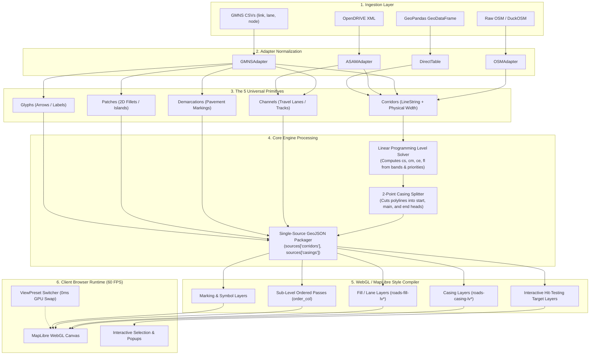
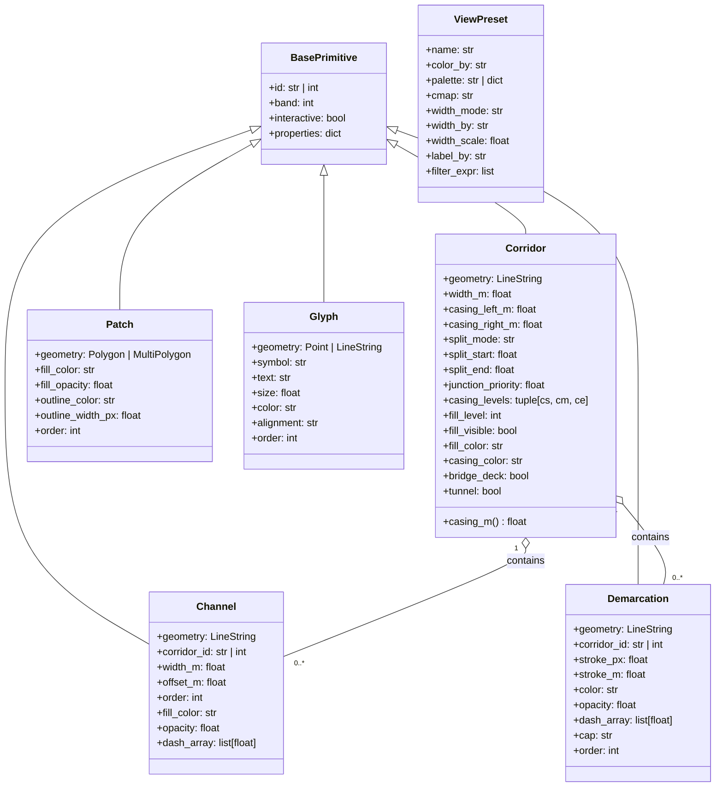
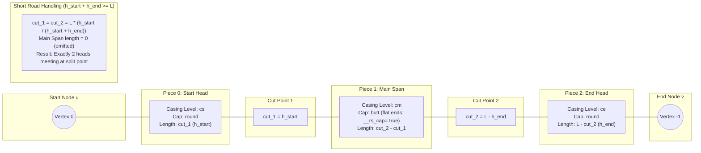
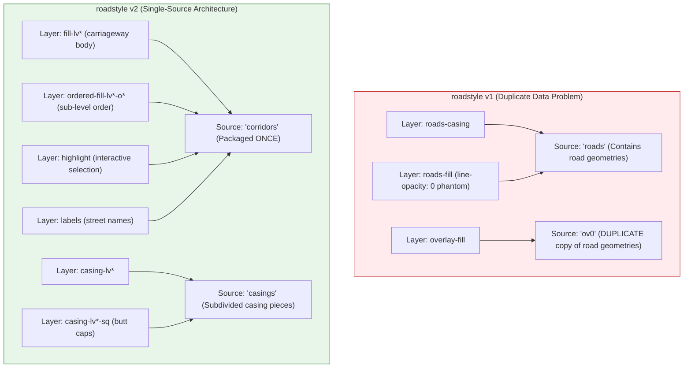
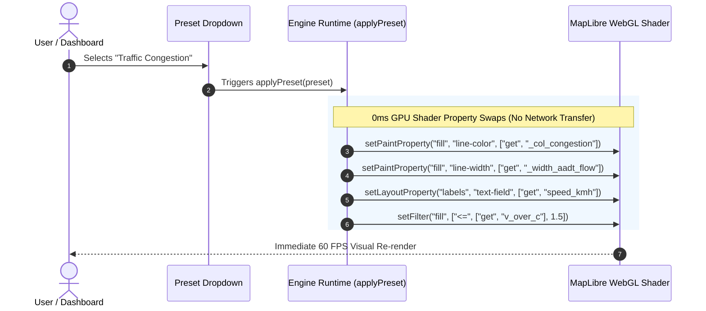
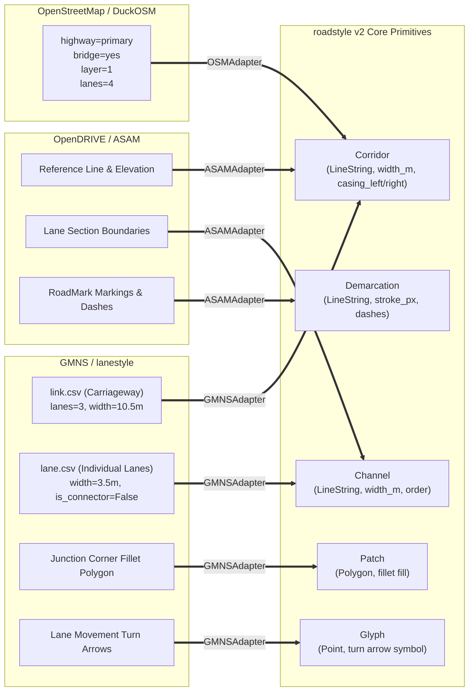

# roadstyle v2: Multi-View Architectural Blueprint

**Status:** Approved Reference  
**Audience:** Core Developers, Integrators, and Domain Adapter Authors  

This document provides a comprehensive visual reference of `roadstyle` v2 through **6 distinct architectural views**. Each view captures a different aspect of the system: pipeline flow, data model taxonomy, physical casing geometry, runtime WebGL memory, dynamic client-side presets, and domain adapter mapping.

---

## 1. System Pipeline View (End-to-End Compilation Flow)

This view traces the lifecycle of network data from raw input files down to GPU vertex buffers on the screen.

---

## 2. Primitive Taxonomy View (The Universal Data Model)

This view details the object hierarchy, physical parameters, and interaction traits of the universal primitives.

---

## 3. Physical Casing & Geometry Anatomy View

This view illustrates how a single corridor polyline is geometrically sliced into three casing pieces using two cut numbers $(c_1, c_2)$.

---

## 4. Single-Source Multi-Layer Runtime Architecture

This view contrasts the old v1 duplicate source architecture against the clean v2 Single-Source Multi-Layer pipeline.

---

## 5. Client-Side Thematic Switching View (`ViewPreset`)

This view shows how multi-dimensional presets (Color, Width, Labels, Filters) are executed directly on the GPU in 0 milliseconds without re-requesting or re-parsing data.

---

## 6. Multi-Domain Adapter Architecture

This view illustrates how diverse transport data standards map seamlessly into the universal primitives without requiring core engine changes.

