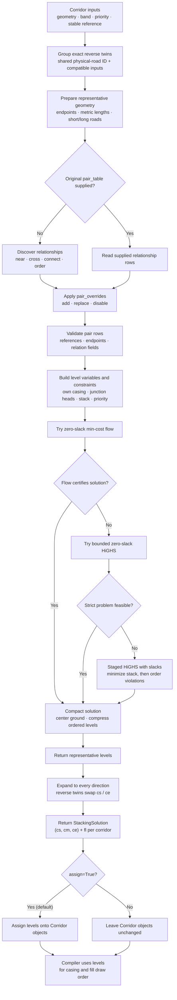

# v2 level calculation

The v2 stacking solver assigns each corridor four drawing-order values:

- `cs`: start casing-head level
- `cm`: main casing level
- `ce`: end casing-head level
- `fl`: corridor fill level

Lower levels are drawn first. At one level, casing passes are drawn before fill
passes. Separating each casing into endpoint heads and a main span allows
junctions to merge cleanly while the main span participates in grade stacking.

This guide describes [`solve_stacking`](../../src/roadstyle/v2/engine/solver.py)
and its pair-table input. It does not describe the v1 `compute_levels` API.

## Calculation workflow

The calculation follows these stages. The pair-table route is optional; without
an explicit table the solver discovers pairs from the current corridor inputs.



The original pair table and automatic discovery are alternatives, not additive
inputs. Overrides are applied to whichever original relationship set is in use.
The optimizer never discovers new pairs after an explicit table has been
supplied.

Before optimization, exact reverse `LineString` geometries are grouped only
when both corridors share an explicit physical-road ID in
`properties["physical_road_id"]`, `properties["road_id"]`,
`properties["way_id"]`, or `properties["osm_id"]`. Their bands, priority
inputs, split mode, and reciprocal start/end split values must also match.
Geometry alone is not enough: unkeyed reverse roads remain independent.
Pair-table references can name either direction; their constraints are mapped
to the representative, with `start` and `end` exchanged when the referenced
edge is reversed. Results are expanded to the original input order: fill and
main-casing levels are shared, while start and end casing levels are swapped.

## 1. Inputs

The solver receives a list of `Corridor` objects:

| Input | How it is used |
|---|---|
| `geometry` | Metric length, proximity, intersections, and endpoint connectivity |
| `band` | Grade precedence: a higher value is above a lower value |
| `junction_priority` | Preferred fill order where same-band roads connect |
| `properties["highway"]` | Road-class priority fallback when explicit priority is zero |
| `split_start` | Used to estimate the effective casing-head length |

Important options are:

| Option | Default | Meaning |
|---|---:|---|
| `band_dist` | 10 m | Maximum distance for discovering stack pairs |
| `head_m` | 15 m | Fallback casing-head length |
| `max_level` | 20 | Internal levels are bounded from 0 to `2 * max_level` |
| `margin` | 1 | Requested separation for stack and priority constraints |
| `time_limit` | 60 s | Time limit for each HiGHS solve |
| `assign` | `True` | Write results onto the corridor objects |

When any corridor has a positive `split_start`, the solver uses the average of
all positive `split_start` values as its effective head length instead of
`head_m`. It classifies a road as short when its metric length is less than
twice this effective value.

Geographic coordinates are projected locally for metric distance and length
calculations. Non-geographic coordinates are used as supplied; metre-based
settings therefore expect projected coordinates in metres.

## 2. Relationship input

Relationship discovery and level optimization are separate steps. By default,
the solver discovers pairs from corridor geometry, bands, and priorities. If
`pair_table` is supplied, it uses those rows instead of rediscovering the
relationships. It then applies the optional `pair_overrides` before building
the optimization constraints. Disabled rows do not contribute constraints.

| Type | Discovery / meaning | Solver effect |
|---|---|---|
| `near` | Different-band roads within `band_dist` that do not intersect | Stack higher-band main casing over the lower road |
| `cross` | Different-band roads whose geometries intersect | Same stack constraint as `near` |
| `connect` | Roads with exactly matching endpoint coordinates; records each endpoint side | Constrain both endpoint heads against the other road's fill |
| `order` | Connected roads with the same band and different priorities | Prefer a later fill for the higher-priority road |

`near` and `cross` both represent stacking. Their separate labels preserve how
the pair was classified. A different-band pair that meets at an endpoint can
have both a stacking row and a `connect` row. An interior line intersection
alone is not discovered as a connection. Manually supplied `connect` rows can
relate a selected start/end head on each edge even when those endpoints do not
coincide; omit `node_ref` in that case. This adds a solver constraint without
snapping or changing either geometry.

For priority discovery, a nonzero `junction_priority` is used directly.
Otherwise, when a `highway` property exists, the road-class order is used. If
no corridor has a usable priority, discovery creates no `order` pairs.

Use [`write_pair_tables`](./pair-tables.md) to save discovered pairs and start
an override file. Persistent tables require stable, unique corridor references
(`id`, `edge_ref`, `ref`, or `edge_id`) so saved rows continue to identify the
same roads across runs. The detailed CSV columns and override actions are
documented in the [pair-table guide](./pair-tables.md).

## 3. Variables and casing parts

Each corridor has one fill variable `b`, returned as `fl`.

- A long corridor has separate casing variables `a_s`, `a_m`, and `a_e`,
  returned as `(cs, cm, ce)`.
- A short corridor has one casing variable shared by its heads, so all three
  returned casing values are equal.

The LP assigns levels to casing parts; casing geometry cutting is handled
separately by the casing compiler and the corridor split settings.

## 4. Constraints

### Own casing

For every casing part `a` on a corridor `x`:

```text
a <= b_x
```

No part of a road's casing is drawn after that road's own fill.

### Connected heads

For a `connect` relationship between corridors `x` and `y`, at the recorded
endpoint:

```text
a_x(endpoint) <= b_y
a_y(endpoint) <= b_x
```

These constraints act on the endpoint heads only. They keep the junction
outlines from covering the fill of the road that joins there.

### Stack pairs

For an enabled `near` or `cross` pair, let `u` be the higher-band corridor and
`l` the lower-band corridor. If `u` is long enough to have a main casing span:

```text
b_l + margin <= a_m(u)
```

This places the upper corridor's main casing after the lower corridor's fill.
The casing heads remain subject to the connected-head constraints. Stack rows
whose upper corridor is short do not create a main-span constraint.

### Priority pairs

For an enabled `order` pair, let `x` be the higher-priority corridor and `y`
the lower-priority corridor:

```text
b_y + margin <= b_x
```

This is a preferred fill ordering, not an override of hard junction-head
constraints.

Own-casing and connected-head constraints are hard. Stack and priority
constraints are preferences and can be relaxed when the bounded problem is
infeasible.

## 5. Optimization

The solver uses internal levels in `[0, 2 * max_level]`. It optimizes in this
priority order:

1. Try to satisfy every stack and priority constraint with no slack. The solver
   tries the minimum-cost-flow formulation first.
2. If the flow cannot certify a solution, try the bounded LP with HiGHS.
3. If the strict problem is infeasible, minimize total stack violation.
4. Minimize total priority violation without worsening the stack result.
5. Minimize casing-to-fill distance and, when enabled, the overall level span
   without worsening either earlier result.

The span term is enabled for the v2 solver. It favors fewer drawing levels,
even if a casing is somewhat farther from its fill. The compaction cost counts
each casing part equally; it is not weighted by the part's physical length.

## 6. Returned solution

`solve_stacking` returns a `StackingSolution` containing:

- `casing_levels`: one `(cs, cm, ce)` tuple per corridor
- `fill_levels`: one `fl` per corridor
- `status`: `OPTIMAL`, or `EMPTY` when the input list is empty
- `info`: solver statistics and pair counts; when the optimization runs, it
  also includes the number of order constraints that were violated

Before returning, the solver shifts the most common main-casing level to ground
(zero), then compresses values into small order-preserving integers.
Compression preserves vertical order but not the numeric gaps from the
internal LP solution. Unless `assign=False` is set, each result is also written
to `Corridor.casing_levels` and `Corridor.fill_level`.

```python
from roadstyle.v2 import solve_stacking

solution = solve_stacking(corridors)
# solution.casing_levels[i] == (cs, cm, ce)
# solution.fill_levels[i] == fl
```

Use `write_level_table` to save the results as a reviewable CSV. It writes one
row per input corridor, including both directions of grouped roads:

```python
from roadstyle.v2 import solve_stacking, write_level_table

solution = solve_stacking(corridors, pair_table="pairs.csv")
write_level_table(corridors, solution, "road_levels.csv")
```

The columns are `edge_ref`, `physical_road_id`, `band`, `cs`, `cm`, `ce`, and
`fl`. The generated Monaco output is stored at
[`data/v2/road_levels.csv`](../../data/v2/road_levels.csv). Its 2,765 rows
include both directions of the 807 grouped exact-reverse pairs.

## Priority tiers (draw order by level)

`solve_stacking(..., priority_tiers=True)` (used by `build_road_levels.py` and the pair
override dashboard) lifts whole tiers above each other after the solve, ignoring band:
roundabouts on top, then tunnels, then every other road. Solved order inside a tier is
kept, and levels are compacted afterwards.
