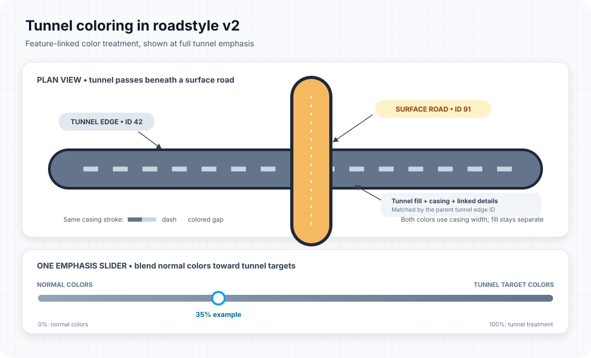

# Tunnel coloring in roadstyle v2

This guide explains how the Monaco v2 dashboard distinguishes tunnels from
surface roads, and how its tunnel-color controls affect the map.

Also available as a [standalone HTML guide](./tunnel-coloring.html).



## The two controls do different things

The dashboard has two independent tunnel-color controls:

1. **Casing palette** selects the two colors used on a tunnel casing. Color 1 is
   the dash; color 2 occupies the part that would otherwise be a transparent
   dash gap.
2. **Tunnel style** is an emphasis slider. It blends each related feature's
   normal color toward its tunnel-specific target color:

   - **0%:** normal feature colors; the casing uses ordinary single-color
     MapLibre dashing, with transparent gaps.
   - **100%:** the full tunnel treatment.
   - **Between:** a continuous color blend between those endpoints.

The tunnel style control is **not** a hue or color-picker slider. Choosing a
casing palette changes its dash and gap target colors; the emphasis slider
controls how far the map moves from its normal colors toward the tunnel
palette. All treatment is rendered with opaque colors rather than translucent
overlays.

## What the tunnel casing is

The **fill** is the broad stroke that paints the road surface. The **casing** is
a separate, narrower boundary stroke drawn around that road. It follows the
casing geometry and its lateral offset; it is not another road fill or a
separate line placed in the gap between two roads.

The casing's line width stays the same when its colors change. Only the color
pattern changes:

```text
along the casing:   [ dash color ][ gap color ][ dash color ][ gap color ] ...
across the casing:  the same casing stroke width for both colors
```

Thus the second palette color fills the portion of the **casing stroke** that
would otherwise be a transparent dash gap. It does not paint the road interior
or change the road fill. The tunnel fill, casing, and surface crossing remain
separate rendered layers/features.

## How colors are blended

For a normal RGB color \(C_n\), tunnel target RGB color \(C_t\), and slider
strength \(s\) from 0 to 1, the dashboard calculates each channel as:

```text
C_display = round((1 - s) * C_normal + s * C_tunnel)
```

For example, at 35%, a tunnel detail target contributes 35% of its target color
and the normal color contributes 65%. MapLibre color expressions do this
interpolation for feature-driven colors. The casing's two-color pattern is
generated from the same slider value so its colors stay in step.

### Tunnel-specific targets

| Feature | Normal/start color | Tunnel target |
|---|---|---|
| Road fill | Each edge's `fill_color` | Slate `#64748b` |
| Casing dash | Slate `#94a3b8` | First color in the selected casing palette |
| Casing gap | Map background `#e2e8f0` | Second color in the selected casing palette |
| Channel casing | Slate `#94a3b8` | Slate `#64748b` |
| Street name | Light gray `#f1f5f9` with dark halo | Blue `#0284c7` with teal halo `#0e7490` |
| Dashed markings and glyph text | Feature color, or white fallback | Cyan `#a5f3fc` |
| Tunnel direction arrow | White | Cyan `#a5f3fc` |

The three casing palettes are:

| Dashboard choice | Dash target | Gap target |
|---|---:|---:|
| Slate + ice | `#64748b` | `#cbd5e1` |
| Blue + cyan | `#315b7d` | `#a9d7e8` |
| Warm + sand | `#806d64` | `#e7c9a7` |

## How tunnel-related features are matched

The map collects the `edge_id` values belonging to tunnel features in its
network source, converts them to strings, and uses that set to recognize
related features. A feature is styled as tunnel-related if it is itself marked
`tunnel: true` or its `edge_id` matches a tunnel edge ID.

That association lets edge-linked channels, markings, glyphs, labels, and
arrows receive tunnel styling even when an individual overlay feature does not
carry its own tunnel flag. Features must preserve the parent road's `edge_id`
for this association to work. Unlinked map annotations cannot be inferred to
belong to a particular tunnel.

## Casing dashes are not rendered twice

MapLibre's `line-dasharray` supports one line color and transparent gaps. It
does not provide a second gap color. Above 0% emphasis, the dashboard instead
creates a small repeating image whose first segment is the dash color and
whose second segment is the gap color, then assigns that image to the tunnel
casing layer's `line-pattern`. That pattern colors the existing casing stroke;
it does not add a second casing or overlay. The normal dash array is cleared
in this mode, so the casing is patterned only once.

At 0%, the pattern is removed and the selected dash lengths are restored as a
normal `line-dasharray`. Surface casing layers are not changed by the tunnel
pattern.

## Crossings and scope

Tunnel fill, tunnel casing, surface roads, and their edge-linked details are
separate rendered features. The tunnel-color treatment only changes colors; it
does not itself determine which road should appear above another at a
crossing. The compiled layer order and each feature's edge/level data control
that behavior. A palette can make the tunnel easier to identify, but it cannot
repair incorrect topology or stacking metadata.

The live example is [the Monaco roads v2 dashboard](./monaco_roads_v2.html).
